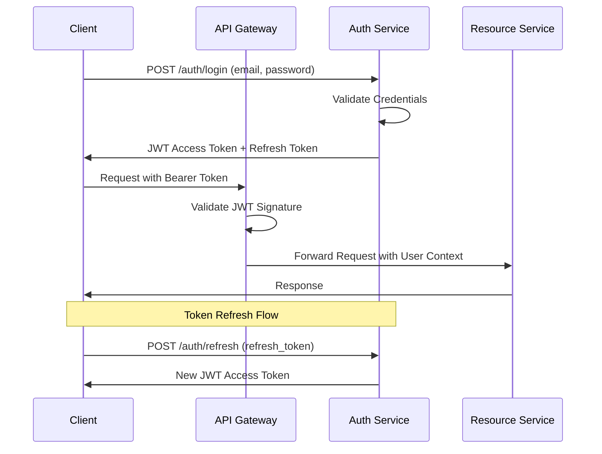

# API Specification - Social Media Sentiment Analysis Platform

## Overview

This document defines the comprehensive REST API specification for the social media sentiment analysis platform, including authentication flows, endpoint contracts, error handling, and real-time communication protocols.

## Authentication & Authorization

### JWT Bearer Token Authentication

#### OAuth 2.0 Flow


#### JWT Token Structure
```json
{
  "header": {
    "alg": "RS256",
    "typ": "JWT",
    "kid": "key-id-123"
  },
  "payload": {
    "sub": "user-uuid",
    "email": "user@example.com",
    "role": "analyst",
    "iat": 1694736000,
    "exp": 1694739600,
    "iss": "sentiment-analysis-platform",
    "aud": "api.sentiment-platform.com",
    "scope": ["sentiment:read", "sentiment:write", "trends:read"]
  }
}
```

### API Key Authentication (For Service-to-Service)
```http
Authorization: ApiKey your-api-key-here
X-API-Key: your-api-key-here
```

## Core API Endpoints

### 1. Authentication Endpoints

#### POST /auth/login
Authenticate user and receive JWT tokens.

**Request:**
```json
{
  "email": "analyst@company.com",
  "password": "securePassword123",
  "rememberMe": true
}
```

**Response (200 OK):**
```json
{
  "accessToken": "eyJhbGciOiJSUzI1NiIsInR5cCI6IkpXVCJ9...",
  "refreshToken": "eyJhbGciOiJSUzI1NiIsInR5cCI6IkpXVCJ9...",
  "expiresIn": 3600,
  "tokenType": "Bearer",
  "user": {
    "id": "uuid",
    "email": "analyst@company.com",
    "firstName": "John",
    "lastName": "Doe",
    "role": "analyst"
  }
}
```

#### POST /auth/refresh
Refresh access token using refresh token.

**Request:**
```json
{
  "refreshToken": "eyJhbGciOiJSUzI1NiIsInR5cCI6IkpXVCJ9..."
}
```

#### POST /auth/logout
Invalidate current session tokens.

### 2. Sentiment Analysis Endpoints

#### POST /api/sentiment/analyze
Analyze sentiment for a single social media post.

**Request:**
```json
{
  "content": "This new technology is absolutely amazing! Can't wait to see what comes next.",
  "platform": "reddit",
  "userId": "user123",
  "userName": "techEnthusiast",
  "sourceUrl": "https://reddit.com/r/technology/post/123",
  "sourceId": "reddit_post_123",
  "metadata": {
    "upvotes": 150,
    "downvotes": 5,
    "commentCount": 25,
    "subreddit": "technology"
  }
}
```

**Response (200 OK):**
```json
{
  "postId": "uuid",
  "sentimentAnalysis": {
    "overallSentiment": "positive",
    "positiveScore": 0.85,
    "negativeScore": 0.05,
    "neutralScore": 0.10,
    "confidenceScore": 0.92,
    "isSarcastic": false,
    "sarcasmScore": 0.15,
    "extractedKeywords": ["technology", "amazing", "wait"],
    "extractedEntities": ["technology"],
    "processingTime": "00:00:00.250"
  },
  "trends": [
    {
      "keyword": "technology",
      "relevanceScore": 0.95
    },
    {
      "keyword": "amazing",
      "relevanceScore": 0.78
    }
  ]
}
```

#### POST /api/sentiment/batch
Process multiple posts in a single request for bulk analysis.

**Request:**
```json
{
  "posts": [
    {
      "content": "First post content...",
      "platform": "reddit",
      "userId": "user1"
    },
    {
      "content": "Second post content...",
      "platform": "twitter",
      "userId": "user2"
    }
  ],
  "options": {
    "priority": "normal",
    "webhookUrl": "https://your-app.com/webhook/batch-complete",
    "includeKeywords": true,
    "includeTrends": true
  }
}
```

**Response (202 Accepted):**
```json
{
  "batchId": "batch-uuid",
  "status": "processing",
  "totalPosts": 2,
  "estimatedCompletionTime": "2024-01-15T10:35:00Z",
  "statusUrl": "/api/sentiment/batch/batch-uuid/status"
}
```

#### GET /api/sentiment/batch/{batchId}/status
Check the status of a batch processing job.

**Response (200 OK):**
```json
{
  "batchId": "batch-uuid",
  "status": "completed",
  "totalPosts": 2,
  "processedPosts": 2,
  "failedPosts": 0,
  "completedAt": "2024-01-15T10:34:45Z",
  "results": [
    {
      "postId": "uuid1",
      "status": "completed",
      "sentimentAnalysis": { /* analysis object */ }
    },
    {
      "postId": "uuid2",
      "status": "completed",
      "sentimentAnalysis": { /* analysis object */ }
    }
  ]
}
```

### 3. Trends Analysis Endpoints

#### GET /api/trends/realtime
Get real-time trending topics and sentiment patterns.

**Query Parameters:**
- `platform` (optional): Filter by platform (reddit, twitter, etc.)
- `timeWindow` (optional): 5m, 15m, 1h, 6h, 24h, 7d (default: 1h)
- `limit` (optional): Number of trends to return (default: 20, max: 100)
- `keyword` (optional): Filter trends containing specific keyword

**Response (200 OK):**
```json
{
  "timeWindow": "1h",
  "generatedAt": "2024-01-15T10:30:00Z",
  "trends": [
    {
      "keyword": "artificial intelligence",
      "trendScore": 0.95,
      "mentionCount": 1250,
      "avgSentimentScore": 0.75,
      "platforms": [
        {
          "platform": "reddit",
          "mentionCount": 800,
          "avgSentiment": 0.78
        },
        {
          "platform": "twitter", 
          "mentionCount": 450,
          "avgSentiment": 0.71
        }
      ],
      "relatedKeywords": ["machine learning", "AI", "technology"],
      "sentimentDistribution": {
        "positive": 0.65,
        "neutral": 0.25,
        "negative": 0.10
      }
    }
  ],
  "metadata": {
    "totalPostsAnalyzed": 15000,
    "platforms": ["reddit", "twitter"],
    "nextUpdate": "2024-01-15T10:35:00Z"
  }
}
```

#### GET /api/trends/keyword/{keyword}/history
Get historical trend data for a specific keyword.

**Query Parameters:**
- `startDate`: ISO 8601 date string
- `endDate`: ISO 8601 date string
- `granularity`: hour, day, week
- `platform` (optional): Filter by platform

**Response (200 OK):**
```json
{
  "keyword": "artificial intelligence",
  "dateRange": {
    "start": "2024-01-01T00:00:00Z",
    "end": "2024-01-15T23:59:59Z"
  },
  "granularity": "day",
  "dataPoints": [
    {
      "date": "2024-01-01",
      "mentionCount": 450,
      "avgSentiment": 0.72,
      "trendScore": 0.65
    },
    {
      "date": "2024-01-02",
      "mentionCount": 520,
      "avgSentiment": 0.78,
      "trendScore": 0.71
    }
  ]
}
```

### 4. Analytics Dashboard Endpoints

#### GET /api/analytics/dashboard
Get comprehensive analytics data for dashboard visualization.

**Query Parameters:**
- `timeRange`: 1h, 6h, 24h, 7d, 30d (default: 24h)
- `platform` (optional): Filter by platform
- `metrics`: Comma-separated list of metrics to include

**Response (200 OK):**
```json
{
  "timeRange": "24h",
  "generatedAt": "2024-01-15T10:30:00Z",
  "summary": {
    "totalPostsProcessed": 45000,
    "avgProcessingTime": "00:00:00.180",
    "systemUptime": 0.999,
    "apiRequestsToday": 8500
  },
  "sentimentDistribution": {
    "positive": 0.45,
    "neutral": 0.35,
    "negative": 0.20
  },
  "platformBreakdown": [
    {
      "platform": "reddit",
      "postCount": 30000,
      "avgSentiment": 0.65,
      "topSubreddits": ["technology", "programming", "news"]
    },
    {
      "platform": "twitter",
      "postCount": 15000,
      "avgSentiment": 0.58
    }
  ],
  "topTrends": [
    {
      "keyword": "artificial intelligence",
      "trendScore": 0.95,
      "change24h": 0.15
    }
  ],
  "performanceMetrics": {
    "avgResponseTime": 185,
    "errorRate": 0.001,
    "throughput": 1200
  }
}
```

#### GET /api/analytics/reports/sentiment-summary
Generate detailed sentiment analysis reports.

**Query Parameters:**
- `startDate`: ISO 8601 date string
- `endDate`: ISO 8601 date string
- `groupBy`: hour, day, week, platform, keyword
- `format`: json, csv (default: json)

### 5. Platform Data Ingestion Endpoints

#### POST /api/ingestion/reddit/trigger
Manually trigger Reddit data ingestion.

**Request:**
```json
{
  "subreddits": ["technology", "programming", "artificial"],
  "filters": {
    "minUpvotes": 50,
    "maxAge": "24h",
    "excludeStickied": true
  },
  "priority": "high"
}
```

#### GET /api/ingestion/status
Get current status of all data ingestion processes.

**Response (200 OK):**
```json
{
  "platforms": [
    {
      "platform": "reddit",
      "status": "running",
      "lastIngestion": "2024-01-15T10:25:00Z",
      "postsIngested": 1250,
      "errors": 0,
      "nextScheduled": "2024-01-15T10:30:00Z"
    }
  ],
  "queueStatus": {
    "pendingAnalysis": 45,
    "processing": 12,
    "avgProcessingTime": "00:00:00.180"
  }
}
```

## Real-Time Communication

### WebSocket Endpoint: /ws/realtime
Real-time updates for dashboard and monitoring.

#### Connection Flow
```javascript
// Client Connection
const ws = new WebSocket('wss://api.sentiment-platform.com/ws/realtime');
ws.onopen = () => {
  // Send authentication
  ws.send(JSON.stringify({
    type: 'auth',
    token: 'your-jwt-token'
  }));
  
  // Subscribe to channels
  ws.send(JSON.stringify({
    type: 'subscribe',
    channels: ['trends', 'analytics', 'alerts']
  }));
};
```

#### Message Types

**Trend Updates:**
```json
{
  "type": "trend_update",
  "channel": "trends",
  "timestamp": "2024-01-15T10:30:00Z",
  "data": {
    "keyword": "artificial intelligence",
    "newMentions": 25,
    "sentimentChange": 0.05,
    "trendScore": 0.95
  }
}
```

**Analytics Updates:**
```json
{
  "type": "analytics_update",
  "channel": "analytics",
  "timestamp": "2024-01-15T10:30:00Z",
  "data": {
    "postsProcessedLastMinute": 85,
    "avgResponseTime": 175,
    "currentThroughput": 1150
  }
}
```

**System Alerts:**
```json
{
  "type": "alert",
  "channel": "alerts",
  "severity": "warning",
  "timestamp": "2024-01-15T10:30:00Z",
  "message": "High processing queue detected",
  "data": {
    "queueSize": 500,
    "threshold": 300
  }
}
```

## Error Handling

### Standard Error Response Format
```json
{
  "error": {
    "code": "VALIDATION_ERROR",
    "message": "Request validation failed",
    "details": [
      {
        "field": "content",
        "message": "Content cannot be empty",
        "code": "REQUIRED_FIELD"
      }
    ],
    "requestId": "req-uuid",
    "timestamp": "2024-01-15T10:30:00Z"
  }
}
```

### HTTP Status Codes
- **200 OK**: Successful request
- **201 Created**: Resource created successfully
- **202 Accepted**: Request accepted for async processing
- **400 Bad Request**: Invalid request parameters
- **401 Unauthorized**: Authentication required
- **403 Forbidden**: Insufficient permissions
- **404 Not Found**: Resource not found
- **409 Conflict**: Resource conflict
- **422 Unprocessable Entity**: Validation errors
- **429 Too Many Requests**: Rate limit exceeded
- **500 Internal Server Error**: Server error
- **503 Service Unavailable**: Service temporarily unavailable

### Error Codes
- `VALIDATION_ERROR`: Request validation failed
- `AUTHENTICATION_REQUIRED`: Valid authentication required
- `INSUFFICIENT_PERMISSIONS`: User lacks required permissions
- `RATE_LIMIT_EXCEEDED`: API rate limit exceeded
- `RESOURCE_NOT_FOUND`: Requested resource not found
- `PROCESSING_ERROR`: Error during sentiment analysis
- `SERVICE_UNAVAILABLE`: External service unavailable

## Rate Limiting

### Limits by User Role
- **Viewer**: 100 requests/hour
- **Analyst**: 1000 requests/hour
- **Admin**: 10000 requests/hour
- **API Key**: Configurable per key

### Rate Limit Headers
```http
X-RateLimit-Limit: 1000
X-RateLimit-Remaining: 999
X-RateLimit-Reset: 1694739600
X-RateLimit-Window: 3600
```

## OpenAPI 3.0 Specification

```yaml
openapi: 3.0.3
info:
  title: Social Media Sentiment Analysis API
  description: Comprehensive API for real-time sentiment analysis of social media content
  version: 1.0.0
  contact:
    name: API Support
    email: api-support@sentiment-platform.com
  license:
    name: MIT
    url: https://opensource.org/licenses/MIT

servers:
  - url: https://api.sentiment-platform.com/v1
    description: Production server
  - url: https://staging-api.sentiment-platform.com/v1
    description: Staging server

security:
  - bearerAuth: []
  - apiKeyAuth: []

components:
  securitySchemes:
    bearerAuth:
      type: http
      scheme: bearer
      bearerFormat: JWT
    apiKeyAuth:
      type: apiKey
      in: header
      name: X-API-Key
```

This API specification provides a comprehensive foundation for building and integrating with the social media sentiment analysis platform, ensuring consistent interfaces, proper authentication, and robust error handling across all endpoints.