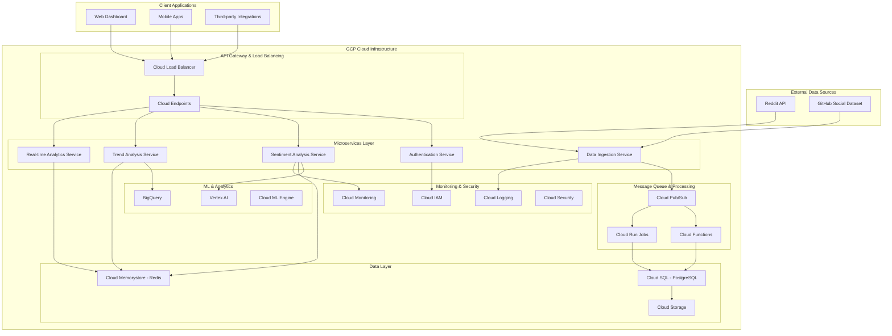

# Social Media Sentiment Analysis Platform - System Architecture

## Executive Summary

This document outlines the comprehensive system architecture for a production-ready social media sentiment analysis platform built on Google Cloud Platform (GCP) using .NET 8/9, designed to handle 1000+ posts per minute with sub-200ms response times and 99.9% uptime.

## Current State Analysis

### Existing Project Structure
```
SentimentAnalysis.API/
├── Program.cs                    # Basic ASP.NET Core setup with weather example
├── SentimentAnalysis.API.csproj  # Project dependencies
├── appsettings.json             # Basic configuration
├── Properties/launchSettings.json
└── SentimentAnalysis.API.http   # API testing file
```

### Current Dependencies Analysis
✅ **Already Configured:**
- **Google Cloud Functions Framework (3.0.1)** - Serverless compute
- **Google Cloud Functions Hosting (3.0.1)** - GCP integration
- **Google Cloud Secret Manager (2.6.0)** - Secure configuration
- **JWT Bearer Authentication (9.0.9)** - Security foundation
- **Entity Framework Core SQL Server (9.0.9)** - Data persistence
- **ML.NET (4.0.2)** - Machine learning capabilities
- **StackExchange.Redis (2.9.17)** - Caching layer
- **Reddit API Client (1.5.2)** - Data source integration
- **OpenAPI/Swagger** - API documentation

## High-Level Architecture Overview



## Core Design Principles

### 1. Cloud-Native Architecture
- **Serverless-First**: Leverage GCP Cloud Functions for auto-scaling
- **Event-Driven**: Pub/Sub messaging for decoupled services
- **Microservices**: Independent, deployable services
- **Infrastructure as Code**: Terraform for reproducible deployments

### 2. Performance & Scalability
- **Target**: 1000+ posts/minute processing capability
- **Response Time**: Sub-200ms for API endpoints
- **Availability**: 99.9% uptime SLA
- **Auto-scaling**: Based on demand and queue depth

### 3. Clean Architecture Patterns
- **Domain-Driven Design**: Clear separation of concerns
- **CQRS**: Command Query Responsibility Segregation
- **Circuit Breaker**: Fault tolerance and resilience
- **Repository Pattern**: Data access abstraction

### 4. Security & Compliance
- **OAuth 2.0 + JWT**: Industry-standard authentication
- **Zero-Trust**: Assume breach security model
- **Data Encryption**: At rest and in transit
- **GDPR Compliance**: Data privacy and protection

## Technology Stack Decision Matrix

| Component | Technology Choice | Rationale | Alternatives Considered |
|-----------|------------------|-----------|------------------------|
| **Runtime** | .NET 9 | High performance, cross-platform, existing codebase | Java, Python, Node.js |
| **Cloud Provider** | Google Cloud Platform | Existing dependencies, cost-effective | AWS, Azure |
| **API Gateway** | Cloud Endpoints | Native GCP integration, OpenAPI support | Kong, Ambassador |
| **Compute** | Cloud Functions + Cloud Run | Serverless scaling, cost optimization | GKE, Compute Engine |
| **Database** | Cloud SQL (PostgreSQL) | ACID compliance, JSON support, scalability | Cloud Spanner, Firestore |
| **Cache** | Cloud Memorystore (Redis) | High performance, existing integration | Cloud Memcache |
| **Message Queue** | Cloud Pub/Sub | Serverless, global, high throughput | Cloud Tasks, RabbitMQ |
| **ML Platform** | Vertex AI + ML.NET | Hybrid approach, existing ML.NET code | AutoML, TensorFlow |
| **Storage** | Cloud Storage | Cost-effective, integration ready | Cloud Filestore |
| **Analytics** | BigQuery | Real-time analytics, SQL interface | Cloud Dataflow, Dataproc |
| **Monitoring** | Cloud Operations Suite | Native integration, comprehensive | Datadog, New Relic |

## Next Steps

This architecture overview provides the foundation for detailed design documents covering:

1. **Database Schema Design** - Detailed Entity Framework models
2. **API Specification** - OpenAPI contracts and authentication flows  
3. **Microservices Architecture** - Service boundaries and communication
4. **Deployment Strategy** - Container orchestration and CI/CD
5. **Performance Optimization** - Caching strategies and scaling policies
6. **Security Implementation** - OAuth flows and data protection
7. **Monitoring & Observability** - Metrics, logging, and alerting

Each component will be designed to meet the performance, scalability, and reliability requirements while maintaining clean architecture principles and leveraging GCP's managed services for operational efficiency.