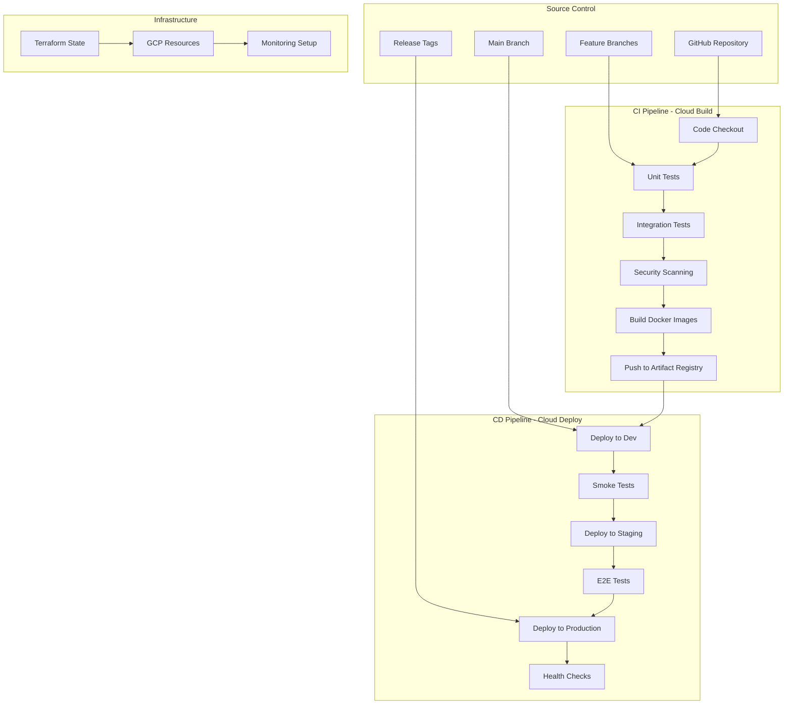

# CI/CD Pipeline and Infrastructure as Code - Social Media Sentiment Analysis Platform

## Overview

This document defines the comprehensive CI/CD pipeline and Infrastructure as Code (IaC) strategy for the social media sentiment analysis platform using Google Cloud Build, Terraform, and GitOps principles to enable reliable, automated, and secure deployments across multiple environments.

## CI/CD Architecture Overview

### 1. Pipeline Architecture



### 2. GitOps Workflow

```mermaid
graph LR
    subgraph "Developer Workflow"
        A[Feature Branch]
        B[Pull Request]
        C[Code Review]
        D[Merge to Main]
    end
    
    subgraph "Automated Pipeline"
        E[CI Pipeline Trigger]
        F[Automated Tests]
        G[Build & Package]
        H[Deploy to Dev]
    end
    
    subgraph "Release Process"
        I[Create Release Tag]
        J[Staging Deployment]
        K[Production Approval]
        L[Production Deployment]
    end
    
    A --> B
    B --> C
    C --> D
    D --> E
    E --> F
    F --> G
    G --> H
    
    H --> I
    I --> J
    J --> K
    K --> L
```



## Infrastructure as Code with Terraform

### 1. Terraform Project Structure

```
infrastructure/
├── .terraform/                    # Terraform state and modules cache
├── environments/                  # Environment-specific configurations
│   ├── dev/
│   │   ├── main.tf
│   │   ├── variables.tf
│   │   ├── outputs.tf
│   │   ├── terraform.tfvars
│   │   └── backend.tf
│   ├── staging/
│   │   ├── main.tf
│   │   ├── variables.tf
│   │   ├── outputs.tf
│   │   ├── terraform.tfvars
│   │   └── backend.tf
│   └── production/
│       ├── main.tf
│       ├── variables.tf
│       ├── outputs.tf
│       ├── terraform.tfvars
│       └── backend.tf
├── modules/                       # Reusable Terraform modules
│   ├── cloud-functions/
│   │   ├── main.tf
│   │   ├── variables.tf
│   │   ├── outputs.tf
│   │   └── README.md
│   ├── cloud-run/
│   │   ├── main.tf
│   │   ├── variables.tf
│   │   ├── outputs.tf
│   │   └── README.md
│   ├── cloud-sql/
│   │   ├── main.tf
│   │   ├── variables.tf
│   │   ├── outputs.tf
│   │   └── README.md
│   ├── networking/
│   │   ├── main.tf
│   │   ├── variables.tf
│   │   ├── outputs.tf
│   │   └── README.md
│   └── monitoring/
│       ├── main.tf
│       ├── variables.tf
│       ├── outputs.tf
│       └── README.md
├── shared/                        # Shared configurations
│   ├── provider.tf
│   ├── versions.tf
│   └── backend.tf
├── scripts/                       # Automation scripts
│   ├── apply.sh
│   ├── plan.sh
│   ├── destroy.sh
│   └── validate.sh
└── docs/                          # Infrastructure documentation
    ├── architecture.md
    ├── runbooks.md
    └── troubleshooting.md
```

### 2. Terraform Backend Configuration

#### Remote State Management
```hcl
# shared/backend.tf
terraform {
  backend "gcs" {
    bucket = "sentiment-analysis-terraform-state"
    prefix = "environments"
  }
}

# State bucket creation
resource "google_storage_bucket" "terraform_state" {
  name          = "sentiment-analysis-terraform-state"
  location      = "US"
  force_destroy = false
  
  versioning {
    enabled = true
  }
  
  lifecycle_rule {
    condition {
      age = 30
    }
    action {
      type = "Delete"
    }
  }
  
  uniform_bucket_level_access = true
}
```

#### Provider Configuration
```hcl
# shared/provider.tf
terraform {
  required_version = ">= 1.0"
  
  required_providers {
    google = {
      source  = "hashicorp/google"
      version = "~> 4.0"
    }
    google-beta = {
      source  = "hashicorp/google-beta"
      version = "~> 4.0"
    }
    random = {
      source  = "hashicorp/random"
      version = "~> 3.1"
    }
  }
}

provider "google" {
  project = var.project_id
  region  = var.region
}

provider "google-beta" {
  project = var.project_id
  region  = var.region
}
```

### 3. Environment-Specific Configuration

#### Production Environment
```hcl
# environments/production/main.tf
module "networking" {
  source = "../../modules/networking"
  
  project_id   = var.project_id
  environment  = "production"
  network_name = "sentiment-analysis-vpc-prod"
  
  subnets = [
    {
      subnet_name   = "private-subnet-us-central1"
      subnet_ip     = "10.0.1.0/24"
      subnet_region = "us-central1"
    },
    {
      subnet_name   = "private-subnet-us-east1"
      subnet_ip     = "10.0.2.0/24"
      subnet_region = "us-east1"
    }
  ]
}

module "cloud_sql" {
  source = "../../modules/cloud-sql"
  
  project_id            = var.project_id
  environment           = "production"
  instance_name         = "sentiment-analysis-db-prod"
  database_version      = "POSTGRES_14"
  tier                  = "db-custom-4-16384"  # 4 vCPU, 16GB RAM
  availability_type     = "REGIONAL"
  disk_type            = "PD_SSD"
  disk_size            = 100
  disk_autoresize      = true
  disk_autoresize_limit = 1000
  
  backup_configuration = {
    enabled                        = true
    start_time                    = "03:00"
    point_in_time_recovery_enabled = true
    transaction_log_retention_days = 7
    backup_retention_settings = {
      retained_backups = 30
      retention_unit   = "COUNT"
    }
  }
  
  vpc_network = module.networking.network_self_link
  
  databases = ["sentiment_analysis"]
  users = {
    "app_user" = {
      password = var.db_password
    }
  }
}

module "cloud_functions" {
  source = "../../modules/cloud-functions"
  
  project_id  = var.project_id
  environment = "production"
  
  functions = {
    sentiment-analysis = {
      name                  = "sentiment-analysis-prod"
      description          = "Production sentiment analysis function"
      runtime              = "dotnet6"
      available_memory_mb  = 1024
      timeout              = 300
      max_instances        = 100
      min_instances        = 5
      vpc_connector        = module.networking.vpc_connector_name
      
      environment_variables = {
        DB_CONNECTION    = module.cloud_sql.connection_name
        REDIS_CONNECTION = module.redis.connection_string
        MODEL_PATH       = "gs://sentiment-models-prod/latest"
      }
      
      event_trigger = {
        event_type = "google.pubsub.topic.publish"
        resource   = module.pubsub.topic_names["sentiment-analysis-requests"]
      }
    }
    
    data-ingestion = {
      name                 = "data-ingestion-prod"
      description         = "Production data ingestion function"
      runtime             = "dotnet6"
      available_memory_mb = 512
      timeout             = 540
      max_instances       = 20
      min_instances       = 2
      
      schedule = "*/5 * * * *"  # Every 5 minutes
      
      environment_variables = {
        REDDIT_CLIENT_ID     = var.reddit_client_id
        REDDIT_CLIENT_SECRET = var.reddit_client_secret
        DB_CONNECTION        = module.cloud_sql.connection_name
      }
    }
  }
}

module "monitoring" {
  source = "../../modules/monitoring"
  
  project_id         = var.project_id
  environment        = "production"
  notification_email = var.notification_email
  
  alert_policies = [
    {
      name         = "High Error Rate"
      display_name = "High Error Rate - Production"
      conditions = [
        {
          display_name = "Cloud Function Error Rate"
          filter      = "resource.type=\"cloud_function\" AND resource.label.function_name=~\"sentiment-analysis-prod|data-ingestion-prod\""
          comparison  = "COMPARISON_GT"
          threshold   = 0.05
          duration    = "300s"
        }
      ]
    },
    {
      name         = "Database High CPU"
      display_name = "Database High CPU - Production"
      conditions = [
        {
          display_name = "Cloud SQL CPU Utilization"
          filter      = "resource.type=\"cloudsql_database\" AND resource.label.database_id=\"${var.project_id}:${module.cloud_sql.instance_name}\""
          comparison  = "COMPARISON_GT"
          threshold   = 0.8
          duration    = "300s"
        }
      ]
    }
  ]
}
```

### 4. Terraform Automation Scripts

#### Plan and Apply Script
```bash
#!/bin/bash
# scripts/apply.sh

set -e

ENVIRONMENT=${1:-dev}
ACTION=${2:-plan}

if [[ ! -d "environments/$ENVIRONMENT" ]]; then
    echo "Environment $ENVIRONMENT does not exist"
    exit 1
fi

cd "environments/$ENVIRONMENT"

echo "Initializing Terraform for $ENVIRONMENT environment..."
terraform init -upgrade

echo "Validating Terraform configuration..."
terraform validate

if [[ "$ACTION" == "plan" ]]; then
    echo "Planning Terraform changes for $ENVIRONMENT..."
    terraform plan -var-file="terraform.tfvars" -out="tfplan"
elif [[ "$ACTION" == "apply" ]]; then
    echo "Applying Terraform changes for $ENVIRONMENT..."
    if [[ -f "tfplan" ]]; then
        terraform apply "tfplan"
        rm -f tfplan
    else
        echo "No plan file found. Run plan first."
        exit 1
    fi
elif [[ "$ACTION" == "destroy" ]]; then
    echo "Destroying Terraform resources for $ENVIRONMENT..."
    terraform destroy -var-file="terraform.tfvars" -auto-approve
else
    echo "Invalid action: $ACTION. Use plan, apply, or destroy."
    exit 1
fi

echo "Terraform $ACTION completed for $ENVIRONMENT environment."
```

#### Validation Script
```bash
#!/bin/bash
# scripts/validate.sh

set -e

echo "Running Terraform validation across all environments..."

# Format check
echo "Checking Terraform format..."
if ! terraform fmt -check -recursive .; then
    echo "Terraform files are not properly formatted. Run 'terraform fmt -recursive .' to fix."
    exit 1
fi

# Validate each environment
for env in environments/*/; do
    if [[ -d "$env" ]]; then
        env_name=$(basename "$env")
        echo "Validating $env_name environment..."
        
        cd "$env"
        terraform init -backend=false
        terraform validate
        cd - > /dev/null
    fi
done

# Security scanning with tfsec
if command -v tfsec &> /dev/null; then
    echo "Running security scan with tfsec..."
    tfsec .
else
    echo "tfsec not found. Install it for security scanning."
fi

echo "All validations passed!"
```

## CI/CD Pipeline Implementation

### 1. Cloud Build Configuration

#### Main CI Pipeline
```yaml
# cloudbuild.yaml
steps:
  # Checkout code
  - name: 'gcr.io/cloud-builders/git'
    args: ['submodule', 'update', '--init', '--recursive']
    
  # Restore dependencies
  - name: 'mcr.microsoft.com/dotnet/sdk:8.0'
    entrypoint: 'dotnet'
    args: ['restore', 'SocialMediaSentimentAnalysis.sln']
    
  # Run unit tests
  - name: 'mcr.microsoft.com/dotnet/sdk:8.0'
    entrypoint: 'dotnet'
    args: ['test', 'tests/UnitTests/', '--configuration', 'Release', '--logger', 'trx', '--collect:"XPlat Code Coverage"']
    env:
      - 'ASPNETCORE_ENVIRONMENT=Testing'
      
  # Run integration tests
  - name: 'mcr.microsoft.com/dotnet/sdk:8.0'
    entrypoint: 'dotnet'
    args: ['test', 'tests/IntegrationTests/', '--configuration', 'Release', '--logger', 'trx']
    env:
      - 'ASPNETCORE_ENVIRONMENT=Testing'
      - 'ConnectionStrings__DefaultConnection=Server=localhost;Database=SentimentAnalysisTest;User Id=postgres;Password=test;'
    
  # Security scanning with Snyk
  - name: 'snyk/snyk:dotnet'
    args: ['test', '--severity-threshold=high']
    env:
      - 'SNYK_TOKEN=$_SNYK_TOKEN'
      
  # Build Docker images
  - name: 'gcr.io/cloud-builders/docker'
    args: [
      'build',
      '-t', '${_REGION}-docker.pkg.dev/${PROJECT_ID}/${_ARTIFACT_REGISTRY_REPO}/sentiment-api:${BUILD_ID}',
      '-t', '${_REGION}-docker.pkg.dev/${PROJECT_ID}/${_ARTIFACT_REGISTRY_REPO}/sentiment-api:latest',
      '-f', 'src/Presentation/SentimentAnalysis.API/Dockerfile',
      '.'
    ]
    
  # Push images to Artifact Registry
  - name: 'gcr.io/cloud-builders/docker'
    args: ['push', '--all-tags', '${_REGION}-docker.pkg.dev/${PROJECT_ID}/${_ARTIFACT_REGISTRY_REPO}/sentiment-api']
    
  # Deploy to development environment
  - name: 'gcr.io/cloud-builders/gcloud'
    entrypoint: 'bash'
    args:
      - '-c'
      - |
        if [[ "$BRANCH_NAME" == "main" ]]; then
          gcloud run deploy sentiment-api-dev \
            --image=${_REGION}-docker.pkg.dev/${PROJECT_ID}/${_ARTIFACT_REGISTRY_REPO}/sentiment-api:${BUILD_ID} \
            --region=${_REGION} \
            --platform=managed \
            --allow-unauthenticated \
            --set-env-vars="ENVIRONMENT=development"
        fi

# Trigger configuration
options:
  logging: CLOUD_LOGGING_ONLY
  machineType: 'E2_HIGHCPU_8'
  
timeout: '1200s'

substitutions:
  _REGION: 'us-central1'
  _ARTIFACT_REGISTRY_REPO: 'sentiment-analysis'

# Available to all triggered builds
availableSecrets:
  secretManager:
    - versionName: projects/${PROJECT_ID}/secrets/snyk-token/versions/latest
      env: '_SNYK_TOKEN'
```

#### Production Deployment Pipeline
```yaml
# cloudbuild-prod.yaml
steps:
  # Security scan of production image
  - name: 'gcr.io/cloud-builders/gcloud'
    entrypoint: 'bash'
    args:
      - '-c'
      - |
        gcloud container images scan \
          ${_REGION}-docker.pkg.dev/${PROJECT_ID}/${_ARTIFACT_REGISTRY_REPO}/sentiment-api:${TAG_NAME} \
          --format="value(response.scan.analysisStatus)"
          
  # Deploy to staging first
  - name: 'gcr.io/cloud-builders/gcloud'
    entrypoint: 'bash'
    args:
      - '-c'
      - |
        gcloud run deploy sentiment-api-staging \
          --image=${_REGION}-docker.pkg.dev/${PROJECT_ID}/${_ARTIFACT_REGISTRY_REPO}/sentiment-api:${TAG_NAME} \
          --region=${_REGION} \
          --platform=managed \
          --no-allow-unauthenticated \
          --set-env-vars="ENVIRONMENT=staging" \
          --max-instances=10
          
  # Run smoke tests against staging
  - name: 'mcr.microsoft.com/dotnet/sdk:8.0'
    entrypoint: 'dotnet'
    args: ['test', 'tests/SmokeTests/', '--configuration', 'Release']
    env:
      - 'TEST_ENVIRONMENT=staging'
      - 'API_BASE_URL=https://sentiment-api-staging-${_REGION}.run.app'
      
  # Wait for manual approval (production gate)
  - name: 'gcr.io/cloud-builders/gcloud'
    entrypoint: 'bash'
    args:
      - '-c'
      - |
        echo "Staging deployment successful. Waiting for production approval..."
        # This would integrate with your approval system
        
  # Deploy to production with canary strategy
  - name: 'gcr.io/cloud-builders/gcloud'
    entrypoint: 'bash'
    args:
      - '-c'
      - |
        # Deploy new version with 10% traffic
        gcloud run deploy sentiment-api-prod \
          --image=${_REGION}-docker.pkg.dev/${PROJECT_ID}/${_ARTIFACT_REGISTRY_REPO}/sentiment-api:${TAG_NAME} \
          --region=${_REGION} \
          --platform=managed \
          --no-allow-unauthenticated \
          --set-env-vars="ENVIRONMENT=production" \
          --max-instances=100 \
          --min-instances=5 \
          --no-traffic
          
        # Get the new revision
        NEW_REVISION=$(gcloud run revisions list --service=sentiment-api-prod --region=${_REGION} --limit=1 --format="value(metadata.name)")
        
        # Route 10% traffic to new revision
        gcloud run services update-traffic sentiment-api-prod \
          --region=${_REGION} \
          --to-revisions=${NEW_REVISION}=10
          
  # Monitor canary deployment
  - name: 'gcr.io/cloud-builders/gcloud'
    entrypoint: 'bash'
    args:
      - '-c'
      - |
        echo "Monitoring canary deployment for 10 minutes..."
        sleep 600
        
        # Check error rates and performance metrics
        ERROR_RATE=$(gcloud logging read "resource.type=cloud_run_revision AND resource.labels.service_name=sentiment-api-prod AND httpRequest.status>=400" --limit=100 --format="value(timestamp)" | wc -l)
        
        if [ $ERROR_RATE -lt 5 ]; then
          echo "Canary deployment successful. Promoting to 100% traffic..."
          gcloud run services update-traffic sentiment-api-prod \
            --region=${_REGION} \
            --to-latest
        else
          echo "High error rate detected. Rolling back..."
          gcloud run services update-traffic sentiment-api-prod \
            --region=${_REGION} \
            --to-revisions=LATEST=0
          exit 1
        fi

options:
  logging: CLOUD_LOGGING_ONLY
  
timeout: '3600s'

substitutions:
  _REGION: 'us-central1'
  _ARTIFACT_REGISTRY_REPO: 'sentiment-analysis'
```

### 2. Infrastructure Pipeline

#### Terraform CI/CD Pipeline
```yaml
# cloudbuild-terraform.yaml
steps:
  # Install Terraform
  - name: 'hashicorp/terraform:1.6'
    entrypoint: 'sh'
    args:
      - '-c'
      - |
        cd infrastructure
        
        # Validate all environments
        for env in environments/*/; do
          if [[ -d "$env" ]]; then
            echo "Validating $(basename $env)..."
            cd "$env"
            terraform init -backend=false
            terraform validate
            cd - > /dev/null
          fi
        done
        
  # Format check
  - name: 'hashicorp/terraform:1.6'
    args: ['fmt', '-check', '-recursive', 'infrastructure/']
    
  # Security scan with tfsec
  - name: 'aquasec/tfsec:latest'
    args: ['infrastructure/', '--format', 'json', '--out', 'tfsec-results.json']
    
  # Plan infrastructure changes for affected environment
  - name: 'hashicorp/terraform:1.6'
    entrypoint: 'sh'
    args:
      - '-c'
      - |
        cd infrastructure/environments/${_ENVIRONMENT}
        
        terraform init
        terraform plan -var-file="terraform.tfvars" -out="tfplan"
        
        # Save plan for review
        terraform show -json tfplan > plan.json
        
  # Apply changes (only on main branch and for specific environments)
  - name: 'hashicorp/terraform:1.6'
    entrypoint: 'sh'
    args:
      - '-c'
      - |
        if [[ "$BRANCH_NAME" == "main" && "$_AUTO_APPLY" == "true" ]]; then
          cd infrastructure/environments/${_ENVIRONMENT}
          terraform apply tfplan
        else
          echo "Skipping apply - requires main branch and auto_apply=true"
        fi

options:
  logging: CLOUD_LOGGING_ONLY
  
timeout: '1800s'

substitutions:
  _ENVIRONMENT: 'dev'
  _AUTO_APPLY: 'false'

# Manual trigger for production
availableSecrets:
  secretManager:
    - versionName: projects/${PROJECT_ID}/secrets/terraform-service-account/versions/latest
      env: 'GOOGLE_APPLICATION_CREDENTIALS'
```

### 3. Automated Testing Strategy

#### Test Pyramid Implementation
```yaml
# Test execution order in CI pipeline
test_stages:
  unit_tests:
    description: "Fast, isolated unit tests"
    duration: "< 5 minutes"
    coverage_target: "> 80%"
    tools: ["xUnit", "Moq", "FluentAssertions"]
    
  integration_tests:
    description: "Database and service integration tests"
    duration: "< 15 minutes"
    dependencies: ["Test Database", "Redis", "Pub/Sub Emulator"]
    tools: ["TestContainers", "Docker Compose"]
    
  contract_tests:
    description: "API contract validation"
    duration: "< 10 minutes"
    tools: ["Pact", "OpenAPI Validator"]
    
  smoke_tests:
    description: "Basic functionality validation"
    duration: "< 5 minutes"
    target: "Deployed environment"
    
  end_to_end_tests:
    description: "Full user journey validation"
    duration: "< 30 minutes"
    target: "Staging environment"
    tools: ["Playwright", "SpecFlow"]
    
  performance_tests:
    description: "Load and performance validation"
    duration: "< 45 minutes"
    target: "Staging environment"
    tools: ["NBomber", "Artillery"]
```

#### Test Configuration
```csharp
// tests/IntegrationTests/TestBase.cs
public abstract class IntegrationTestBase : IClassFixture<WebApplicationFactory<Program>>
{
    protected readonly WebApplicationFactory<Program> Factory;
    protected readonly HttpClient Client;
    protected readonly TestcontainersBuilder ContainerBuilder;

    protected IntegrationTestBase(WebApplicationFactory<Program> factory)
    {
        Factory = factory.WithWebHostBuilder(builder =>
        {
            builder.ConfigureTestServices(services =>
            {
                // Replace production services with test doubles
                services.RemoveAll<IDbContextOptions<SentimentAnalysisDbContext>>();
                services.AddDbContext<SentimentAnalysisDbContext>(options =>
                {
                    options.UseNpgsql(GetTestConnectionString());
                });
                
                services.RemoveAll<ISentimentAnalysisService>();
                services.AddScoped<ISentimentAnalysisService, MockSentimentAnalysisService>();
            });
        });
        
        Client = Factory.CreateClient();
    }

    private string GetTestConnectionString()
    {
        // Use TestContainers for isolated database testing
        var container = new TestcontainersBuilder<PostgreSqlTestcontainer>()
            .WithPostgreSql()
            .WithDatabase("sentiment_test")
            .WithUsername("test_user")
            .WithPassword("test_password")
            .Build();
            
        container.StartAsync().Wait();
        
        return container.ConnectionString;
    }
}
```

## Deployment Strategies

### 1. Blue-Green Deployment

#### Cloud Run Blue-Green Implementation
```bash
#!/bin/bash
# scripts/blue-green-deploy.sh

SERVICE_NAME="sentiment-api-prod"
REGION="us-central1"
NEW_IMAGE=$1

if [[ -z "$NEW_IMAGE" ]]; then
    echo "Usage: $0 <new-image-url>"
    exit 1
fi

echo "Starting blue-green deployment for $SERVICE_NAME..."

# Get current revision (blue)
CURRENT_REVISION=$(gcloud run revisions list \
    --service=$SERVICE_NAME \
    --region=$REGION \
    --filter="status.conditions.type:Active AND status.conditions.status:True" \
    --format="value(metadata.name)" \
    --limit=1)

echo "Current active revision: $CURRENT_REVISION"

# Deploy new revision (green) with no traffic
echo "Deploying new revision with no traffic..."
gcloud run deploy $SERVICE_NAME \
    --image=$NEW_IMAGE \
    --region=$REGION \
    --no-traffic \
    --tag=green

# Get new revision name
NEW_REVISION=$(gcloud run revisions list \
    --service=$SERVICE_NAME \
    --region=$REGION \
    --limit=1 \
    --format="value(metadata.name)")

echo "New revision deployed: $NEW_REVISION"

# Run health checks against green revision
echo "Running health checks against green revision..."
GREEN_URL=$(gcloud run services describe $SERVICE_NAME \
    --region=$REGION \
    --format="value(status.traffic[0].url)" | sed 's/https:\/\//https:\/\/green---/')

# Perform health checks
for i in {1..5}; do
    if curl -f "$GREEN_URL/health" > /dev/null 2>&1; then
        echo "Health check $i passed"
    else
        echo "Health check $i failed"
        exit 1
    fi
    sleep 10
done

# Switch traffic to green
echo "Switching traffic to green revision..."
gcloud run services update-traffic $SERVICE_NAME \
    --region=$REGION \
    --to-revisions=$NEW_REVISION=100

echo "Blue-green deployment completed successfully!"

# Optional: Clean up old revision after verification period
echo "Cleaning up old revision in 10 minutes..."
sleep 600
gcloud run revisions delete $CURRENT_REVISION --region=$REGION --quiet
```

### 2. Canary Deployment

#### Automated Canary with Monitoring
```bash
#!/bin/bash
# scripts/canary-deploy.sh

SERVICE_NAME="sentiment-api-prod"
REGION="us-central1"
NEW_IMAGE=$1
CANARY_PERCENT=${2:-10}
MONITOR_DURATION=${3:-600}  # 10 minutes

# Deploy new revision
gcloud run deploy $SERVICE_NAME \
    --image=$NEW_IMAGE \
    --region=$REGION \
    --no-traffic

# Get new revision
NEW_REVISION=$(gcloud run revisions list \
    --service=$SERVICE_NAME \
    --region=$REGION \
    --limit=1 \
    --format="value(metadata.name)")

# Route canary traffic
gcloud run services update-traffic $SERVICE_NAME \
    --region=$REGION \
    --to-revisions=$NEW_REVISION=$CANARY_PERCENT

echo "Canary deployment started with $CANARY_PERCENT% traffic"
echo "Monitoring for $MONITOR_DURATION seconds..."

# Monitor metrics
START_TIME=$(date +%s)
END_TIME=$((START_TIME + MONITOR_DURATION))

while [[ $(date +%s) -lt $END_TIME ]]; do
    # Check error rate
    ERROR_COUNT=$(gcloud logging read \
        "resource.type=cloud_run_revision AND resource.labels.revision_name=$NEW_REVISION AND httpRequest.status>=400" \
        --limit=50 --format="value(timestamp)" | wc -l)
    
    # Check response time
    AVG_LATENCY=$(gcloud monitoring metrics list \
        --filter="metric.type=run.googleapis.com/request_latencies" \
        --format="value(points[0].value.doubleValue)")
    
    if [[ $ERROR_COUNT -gt 10 ]]; then
        echo "High error rate detected! Rolling back..."
        gcloud run services update-traffic $SERVICE_NAME \
            --region=$REGION \
            --to-revisions=$NEW_REVISION=0
        exit 1
    fi
    
    echo "Monitoring: Errors=$ERROR_COUNT, AvgLatency=${AVG_LATENCY}ms"
    sleep 30
done

# Promote to full traffic
echo "Canary successful! Promoting to 100% traffic..."
gcloud run services update-traffic $SERVICE_NAME \
    --region=$