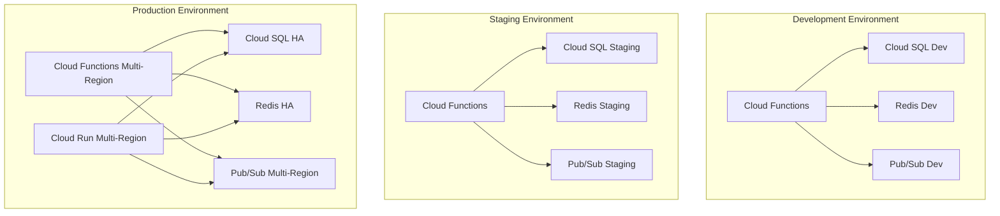

# Deployment Architecture - Social Media Sentiment Analysis Platform

## Overview

This document defines the comprehensive deployment architecture for the social media sentiment analysis platform using Google Cloud Platform (GCP) services, containerization strategies, and auto-scaling configurations to meet the performance requirements of 1000+ posts/minute with 99.9% uptime.

## Deployment Strategy

### 1. Multi-Environment Architecture



### 2. Environment Configuration

| Component | Development | Staging | Production |
|-----------|-------------|---------|-------------|
| **Cloud Functions** | Single Region (us-central1) | Single Region (us-central1) | Multi-Region (us-central1, us-east1) |
| **Cloud Run** | 1 instance min | 2 instances min | 5 instances min, 100 max |
| **Cloud SQL** | db-f1-micro | db-n1-standard-2 | db-n1-standard-4 (HA) |
| **Redis** | Basic 1GB | Standard 4GB | Standard HA 8GB |
| **Pub/Sub** | Single Region | Single Region | Global |
| **Load Balancer** | None | HTTP(S) | Global HTTP(S) with CDN |

## Containerization Strategy

### 1. Docker Images

#### Base Images
```dockerfile
# Base runtime image
FROM mcr.microsoft.com/dotnet/aspnet:8.0-alpine AS base
WORKDIR /app
EXPOSE 80
EXPOSE 443

# SDK image for building
FROM mcr.microsoft.com/dotnet/sdk:8.0-alpine AS build
WORKDIR /src
```

#### API Service Dockerfile
```dockerfile
FROM mcr.microsoft.com/dotnet/aspnet:8.0-alpine AS base
WORKDIR /app
EXPOSE 8080

# Install dependencies for ML.NET
RUN apk add --no-cache \
    icu-libs \
    libgdiplus \
    && rm -rf /var/cache/apk/*

ENV DOTNET_SYSTEM_GLOBALIZATION_INVARIANT=false

FROM mcr.microsoft.com/dotnet/sdk:8.0-alpine AS build
WORKDIR /src

# Copy csproj files and restore dependencies
COPY ["src/Presentation/SentimentAnalysis.API/SentimentAnalysis.API.csproj", "src/Presentation/SentimentAnalysis.API/"]
COPY ["src/Core/SentimentAnalysis.Application/SentimentAnalysis.Application.csproj", "src/Core/SentimentAnalysis.Application/"]
COPY ["src/Core/SentimentAnalysis.Domain/SentimentAnalysis.Domain.csproj", "src/Core/SentimentAnalysis.Domain/"]
COPY ["src/Infrastructure/SentimentAnalysis.Infrastructure/SentimentAnalysis.Infrastructure.csproj", "src/Infrastructure/SentimentAnalysis.Infrastructure/"]
COPY ["src/Infrastructure/SentimentAnalysis.Persistence/SentimentAnalysis.Persistence.csproj", "src/Infrastructure/SentimentAnalysis.Persistence/"]

RUN dotnet restore "src/Presentation/SentimentAnalysis.API/SentimentAnalysis.API.csproj"

# Copy source code and build
COPY . .
WORKDIR "/src/src/Presentation/SentimentAnalysis.API"
RUN dotnet build "SentimentAnalysis.API.csproj" -c Release -o /app/build

FROM build AS publish
RUN dotnet publish "SentimentAnalysis.API.csproj" -c Release -o /app/publish /p:UseAppHost=false

FROM base AS final
WORKDIR /app
COPY --from=publish /app/publish .

# Add health check
HEALTHCHECK --interval=30s --timeout=10s --start-period=60s --retries=3 \
    CMD curl -f http://localhost:8080/health || exit 1

ENTRYPOINT ["dotnet", "SentimentAnalysis.API.dll"]
```

#### Microservice Dockerfile Template
```dockerfile
FROM mcr.microsoft.com/dotnet/aspnet:8.0-alpine AS base
WORKDIR /app
EXPOSE 8080

FROM mcr.microsoft.com/dotnet/sdk:8.0-alpine AS build
WORKDIR /src

# Service-specific build steps
ARG SERVICE_NAME
COPY ["src/Services/${SERVICE_NAME}/${SERVICE_NAME}.csproj", "src/Services/${SERVICE_NAME}/"]
COPY ["src/Shared/", "src/Shared/"]

RUN dotnet restore "src/Services/${SERVICE_NAME}/${SERVICE_NAME}.csproj"

COPY . .
WORKDIR "/src/src/Services/${SERVICE_NAME}"
RUN dotnet build "${SERVICE_NAME}.csproj" -c Release -o /app/build

FROM build AS publish
RUN dotnet publish "${SERVICE_NAME}.csproj" -c Release -o /app/publish

FROM base AS final
WORKDIR /app
COPY --from=publish /app/publish .

# Add non-root user for security
RUN addgroup -g 1001 -S appuser && adduser -S appuser -G appuser
USER appuser

ENTRYPOINT ["dotnet", "${SERVICE_NAME}.dll"]
```

### 2. Multi-Stage Build Optimization

**Build Stages**:
1. **Restore**: Download NuGet packages
2. **Build**: Compile source code
3. **Test**: Run unit tests (optional stage)
4. **Publish**: Create optimized output
5. **Runtime**: Minimal runtime image

**Optimization Techniques**:
- Layer caching for dependency restoration
- Multi-architecture builds (AMD64, ARM64)
- Distroless images for security
- Build argument parameterization

## Cloud Functions Deployment

### 1. Function Configuration

#### Sentiment Analysis Function
```yaml
apiVersion: v1
kind: ConfigMap
metadata:
  name: sentiment-function-config
data:
  function.yaml: |
    name: sentiment-analysis
    runtime: dotnet6
    memory: 1GiB
    timeout: 300s
    maxInstances: 100
    minInstances: 2
    environmentVariables:
      MODEL_PATH: gs://sentiment-models/latest
      DB_CONNECTION: ${secret:postgres-connection}
      REDIS_CONNECTION: ${secret:redis-connection}
    httpsTrigger: {}
```

#### Data Ingestion Function
```yaml
apiVersion: v1
kind: ConfigMap
metadata:
  name: ingestion-function-config
data:
  function.yaml: |
    name: data-ingestion
    runtime: dotnet6
    memory: 512MiB
    timeout: 540s
    maxInstances: 50
    minInstances: 1
    environmentVariables:
      REDDIT_CLIENT_ID: ${secret:reddit-client-id}
      REDDIT_CLIENT_SECRET: ${secret:reddit-client-secret}
    eventTrigger:
      eventType: google.pubsub.topic.publish
      resource: projects/PROJECT_ID/topics/ingestion-trigger
```

### 2. Deployment Scripts

#### Cloud Functions Deployment
```bash
#!/bin/bash
set -e

FUNCTION_NAME=$1
REGION=$2
ENVIRONMENT=$3

echo "Deploying Cloud Function: $FUNCTION_NAME to $REGION ($ENVIRONMENT)"

# Set environment-specific variables
if [ "$ENVIRONMENT" = "production" ]; then
    MIN_INSTANCES=2
    MAX_INSTANCES=100
    MEMORY=1GiB
else
    MIN_INSTANCES=0
    MAX_INSTANCES=10
    MEMORY=512MiB
fi

# Deploy function
gcloud functions deploy $FUNCTION_NAME \
    --gen2 \
    --runtime=dotnet6 \
    --region=$REGION \
    --source=. \
    --entry-point=$FUNCTION_NAME \
    --memory=$MEMORY \
    --timeout=300s \
    --min-instances=$MIN_INSTANCES \
    --max-instances=$MAX_INSTANCES \
    --set-env-vars="ENVIRONMENT=$ENVIRONMENT" \
    --trigger-http \
    --allow-unauthenticated=false
```

## Cloud Run Deployment

### 1. Service Configuration

#### Analytics Service (WebSocket Support)
```yaml
apiVersion: serving.knative.dev/v1
kind: Service
metadata:
  name: analytics-service
  annotations:
    run.googleapis.com/ingress: all
    run.googleapis.com/execution-environment: gen2
spec:
  template:
    metadata:
      annotations:
        autoscaling.knative.dev/minScale: "5"
        autoscaling.knative.dev/maxScale: "100"
        run.googleapis.com/execution-environment: gen2
        run.googleapis.com/cpu-throttling: "false"
    spec:
      containerConcurrency: 80
      timeoutSeconds: 3600
      containers:
      - image: gcr.io/PROJECT_ID/analytics-service:latest
        ports:
        - name: http1
          containerPort: 8080
        resources:
          limits:
            cpu: "2"
            memory: "2Gi"
          requests:
            cpu: "1"
            memory: "1Gi"
        env:
        - name: REDIS_CONNECTION
          valueFrom:
            secretKeyRef:
              name: redis-connection
              key: connection-string
        - name: DB_CONNECTION
          valueFrom:
            secretKeyRef:
              name: postgres-connection
              key: connection-string
        livenessProbe:
          httpGet:
            path: /health
            port: 8080
          initialDelaySeconds: 60
          periodSeconds: 30
        readinessProbe:
          httpGet:
            path: /ready
            port: 8080
          initialDelaySeconds: 30
          periodSeconds: 10
```

### 2. Auto-scaling Configuration

#### Scaling Metrics
```yaml
apiVersion: autoscaling/v2
kind: HorizontalPodAutoscaler
metadata:
  name: analytics-service-hpa
spec:
  scaleTargetRef:
    apiVersion: serving.knative.dev/v1
    kind: Service
    name: analytics-service
  minReplicas: 5
  maxReplicas: 100
  metrics:
  - type: Resource
    resource:
      name: cpu
      target:
        type: Utilization
        averageUtilization: 70
  - type: Resource
    resource:
      name: memory
      target:
        type: Utilization
        averageUtilization: 80
  behavior:
    scaleUp:
      stabilizationWindowSeconds: 60
      policies:
      - type: Percent
        value: 100
        periodSeconds: 60
    scaleDown:
      stabilizationWindowSeconds: 300
      policies:
      - type: Percent
        value: 10
        periodSeconds: 60
```

## Infrastructure as Code (Terraform)

### 1. Project Structure
```
infrastructure/
├── environments/
│   ├── dev/
│   │   ├── main.tf
│   │   ├── variables.tf
│   │   └── terraform.tfvars
│   ├── staging/
│   └── prod/
├── modules/
│   ├── cloud-functions/
│   ├── cloud-run/
│   ├── cloud-sql/
│   ├── redis/
│   ├── pubsub/
│   ├── monitoring/
│   └── networking/
└── shared/
    ├── provider.tf
    ├── backend.tf
    └── versions.tf
```

### 2. Core Infrastructure Modules

#### Cloud SQL Module
```hcl
# modules/cloud-sql/main.tf
resource "google_sql_database_instance" "main" {
  name                = var.instance_name
  database_version    = "POSTGRES_14"
  region             = var.region
  deletion_protection = var.deletion_protection

  settings {
    tier                        = var.tier
    availability_type           = var.availability_type
    disk_type                  = "PD_SSD"
    disk_size                  = var.disk_size
    disk_autoresize           = true
    disk_autoresize_limit     = var.disk_autoresize_limit

    backup_configuration {
      enabled                        = true
      start_time                    = "03:00"
      point_in_time_recovery_enabled = true
      transaction_log_retention_days = 7
      backup_retention_settings {
        retained_backups = 30
        retention_unit   = "COUNT"
      }
    }

    ip_configuration {
      ipv4_enabled                                  = false
      private_network                              = var.vpc_network
      enable_private_path_for_google_cloud_services = true
    }

    insights_config {
      query_insights_enabled  = true
      query_string_length    = 1024
      record_application_tags = true
      record_client_address  = true
    }

    database_flags {
      name  = "log_checkpoints"
      value = "on"
    }

    database_flags {
      name  = "log_connections"
      value = "on"
    }

    database_flags {
      name  = "log_disconnections"
      value = "on"
    }

    database_flags {
      name  = "log_lock_waits"
      value = "on"
    }
  }

  depends_on = [google_service_networking_connection.private_vpc_connection]
}

resource "google_sql_database" "database" {
  name     = var.database_name
  instance = google_sql_database_instance.main.name
}

resource "google_sql_user" "users" {
  for_each = var.users
  name     = each.key
  instance = google_sql_database_instance.main.name
  password = each.value.password
}
```

#### Redis Module
```hcl
# modules/redis/main.tf
resource "google_redis_instance" "cache" {
  name           = var.instance_name
  tier           = var.tier
  memory_size_gb = var.memory_size_gb
  region         = var.region

  location_id             = var.location_id
  alternative_location_id = var.alternative_location_id

  authorized_network = var.authorized_network
  connect_mode       = "PRIVATE_SERVICE_ACCESS"

  redis_version     = var.redis_version
  display_name      = var.display_name
  reserved_ip_range = var.reserved_ip_range

  redis_configs = var.redis_configs

  maintenance_policy {
    weekly_maintenance_window {
      day = "SUNDAY"
      start_time {
        hours   = 2
        minutes = 0
        seconds = 0
        nanos   = 0
      }
    }
  }

  persistence_config {
    persistence_mode    = "RDB"
    rdb_snapshot_period = "TWELVE_HOURS"
  }
}
```

### 3. Production Environment Configuration

```hcl
# environments/prod/main.tf
module "vpc" {
  source = "../../modules/networking"
  
  project_id   = var.project_id
  network_name = "sentiment-analysis-vpc"
  
  subnets = [
    {
      subnet_name   = "private-subnet"
      subnet_ip     = "10.0.1.0/24"
      subnet_region = "us-central1"
    },
    {
      subnet_name   = "private-subnet-east"
      subnet_ip     = "10.0.2.0/24"
      subnet_region = "us-east1"
    }
  ]
}

module "cloud_sql" {
  source = "../../modules/cloud-sql"
  
  instance_name         = "sentiment-analysis-prod"
  region               = "us-central1"
  tier                 = "db-n1-standard-4"
  availability_type    = "REGIONAL"
  disk_size            = 100
  disk_autoresize_limit = 500
  vpc_network          = module.vpc.network_self_link
  deletion_protection  = true
  
  database_name = "sentiment_analysis"
  
  users = {
    "app_user" = {
      password = var.db_password
    }
  }
}

module "redis" {
  source = "../../modules/redis"
  
  instance_name     = "sentiment-analysis-cache-prod"
  tier              = "STANDARD_HA"
  memory_size_gb    = 8
  region            = "us-central1"
  location_id       = "us-central1-a"
  alternative_location_id = "us-central1-b"
  authorized_network = module.vpc.network_self_link
  
  redis_configs = {
    maxmemory-policy = "allkeys-lru"
    timeout          = "300"
  }
}

module "pubsub" {
  source = "../../modules/pubsub"
  
  topics = [
    "sentiment-analysis-requests",
    "sentiment-analysis-completed",
    "trend-updates",
    "user-activity",
    "system-alerts"
  ]
  
  subscriptions = {
    "sentiment-analysis-requests-sub" = {
      topic = "sentiment-analysis-requests"
      ack_deadline_seconds = 300
    }
    "trend-updates-sub" = {
      topic = "trend-updates"
      ack_deadline_seconds = 60
    }
  }
}
```

## Load Balancing and CDN

### 1. Global Load Balancer Configuration

```hcl
resource "google_compute_global_forwarding_rule" "default" {
  name       = "sentiment-analysis-lb"
  target     = google_compute_target_https_proxy.default.id
  port_range = "443"
  ip_address = google_compute_global_address.default.address
}

resource "google_compute_target_https_proxy" "default" {
  name             = "sentiment-analysis-https-proxy"
  url_map          = google_compute_url_map.default.id
  ssl_certificates = [google_compute_managed_ssl_certificate.default.id]
}

resource "google_compute_url_map" "default" {
  name            = "sentiment-analysis-url-map"
  default_service = google_compute_backend_service.api.id

  host_rule {
    hosts        = ["api.sentiment-platform.com"]
    path_matcher = "api-paths"
  }

  path_matcher {
    name            = "api-paths"
    default_service = google_compute_backend_service.api.id

    path_rule {
      paths   = ["/api/sentiment/*"]
      service = google_compute_backend_service.sentiment.id
    }

    path_rule {
      paths   = ["/api/trends/*"]
      service = google_compute_backend_service.trends.id
    }

    path_rule {
      paths   = ["/ws/*"]
      service = google_compute_backend_service.websocket.id
    }
  }
}
```

### 2. Backend Services Configuration

```hcl
resource "google_compute_backend_service" "api" {
  name                  = "sentiment-api-backend"
  protocol              = "HTTP"
  port_name             = "http"
  load_balancing_scheme = "EXTERNAL"
  timeout_sec           = 30
  
  health_checks = [google_compute_health_check.api.id]
  
  backend {
    group           = google_compute_region_network_endpoint_group.api_neg.id
    balancing_mode  = "UTILIZATION"
    capacity_scaler = 1.0
  }

  cdn_policy {
    cache_mode                   = "CACHE_ALL_STATIC"
    signed_url_cache_max_age_sec = 3600
    default_ttl                  = 3600
    max_ttl                      = 86400
    negative_caching             = true
    serve_while_stale           = 86400
  }

  log_config {
    enable      = true
    sample_rate = 1.0
  }
}
```

## Security Configuration

### 1. Identity and Access Management

```hcl
# Service account for Cloud Functions
resource "google_service_account" "function_sa" {
  account_id   = "sentiment-functions"
  display_name = "Sentiment Analysis Functions Service Account"
}

# IAM bindings for database access
resource "google_project_iam_member" "function_sql_client" {
  project = var.project_id
  role    = "roles/cloudsql.client"
  member  = "serviceAccount:${google_service_account.function_sa.email}"
}

# IAM bindings for Pub/Sub
resource "google_project_iam_member" "function_pubsub_publisher" {
  project = var.project_id
  role    = "roles/pubsub.publisher"
  member  = "serviceAccount:${google_service_account.function_sa.email}"
}

resource "google_project_iam_member" "function_pubsub_subscriber" {
  project = var.project_id
  role    = "roles/pubsub.subscriber"
  member  = "serviceAccount:${google_service_account.function_sa.email}"
}
```

### 2. Secret Management

```hcl
resource "google_secret_manager_secret" "db_password" {
  secret_id = "postgres-password"
  
  replication {
    automatic = true
  }
}

resource "google_secret_manager_secret_version" "db_password" {
  secret      = google_secret_manager_secret.db_password.id
  secret_data = var.db_password
}

# Grant access to secrets
resource "google_secret_manager_secret_iam_member" "db_password_access" {
  secret_id = google_secret_manager_secret.db_password.secret_id
  role      = "roles/secretmanager.secretAccessor"
  member    = "serviceAccount:${google_service_account.function_sa.email}"
}
```

## Monitoring and Observability

### 1. Health Checks

```hcl
resource "google_compute_health_check" "api" {
  name                = "sentiment-api-health-check"
  check_interval_sec  = 30
  timeout_sec         = 10
  healthy_threshold   = 2
  unhealthy_threshold = 3

  http_health_check {
    port               = 8080
    request_path       = "/health"
    check_response     = "200"
    proxy_header       = "NONE"
  }

  log_config {
    enable = true
  }
}
```

### 2. Alerting Policies

```hcl
resource "google_monitoring_alert_policy" "high_error_rate" {
  display_name = "High Error Rate"
  combiner     = "OR"
  
  conditions {
    display_name = "Error rate too high"
    
    condition_threshold {
      filter          = "resource.type=\"cloud_function\" AND metric.type=\"cloudfunctions.googleapis.com/function/execution_count\""
      duration        = "300s"
      comparison      = "COMPARISON_GREATER_THAN"
      threshold_value = 0.05
      
      aggregations {
        alignment_period   = "60s"
        per_series_aligner = "ALIGN_RATE"
        cross_series_reducer = "REDUCE_MEAN"
        group_by_fields    = ["resource.label.function_name"]
      }
    }
  }

  notification_channels = [
    google_monitoring_notification_channel.email.name
  ]
}
```

## Disaster Recovery and Backup

### 1. Backup Strategy

**Database Backups**:
- Automated daily backups with 30-day retention
- Point-in-time recovery enabled
- Cross-region backup replication

**Application State**:
- Redis persistence with RDB snapshots
- Function code stored in Cloud Source Repositories
- Container images in Artifact Registry with retention policies

### 2. Multi-Region Deployment

**Primary Region**: us-central1
**Secondary Region**: us-east1

**Failover Strategy**:
- DNS-based traffic routing
- Automated health checks
- Database replica promotion
- Function deployment across regions

This deployment architecture provides a robust, scalable, and secure foundation for the social media sentiment analysis platform, meeting the performance requirements while maintaining operational excellence and cost efficiency.