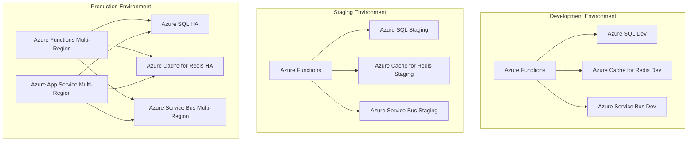

# Deployment Architecture - Social Media Sentiment Analysis Platform

## Overview

This document defines the comprehensive deployment architecture for the social media sentiment analysis platform using Azure services, containerization strategies, and auto-scaling configurations to meet the performance requirements of 1000+ posts/minute with 99.9% uptime.

## Deployment Strategy

### 1. Multi-Environment Architecture



### 2. Environment Configuration

| Component | Development | Staging | Production |
|-----------|-------------|---------|-------------|
| **Azure Functions** | Consumption Plan | Premium Plan | Premium Plan (Multi-Region) |
| **Azure App Service** | B1 (Basic) | S1 (Standard) | P2V2 (Premium V2) (Multi-Region) |
| **Azure SQL Database** | Basic (DTU) | Standard (vCore) | Premium (vCore) (HA) |
| **Azure Cache for Redis** | Basic 1GB | Standard 4GB | Premium 8GB (HA) |
| **Azure Service Bus** | Standard | Standard | Premium (Geo-Disaster Recovery) |
| **Load Balancer** | None | Azure Application Gateway | Azure Front Door with CDN |

## Containerization Strategy

### 1. Docker Images

#### Base Images
```dockerfile
# Base runtime image
FROM mcr.microsoft.com/dotnet/aspnet:8.0-alpine AS base
WORKDIR /app
EXPOSE 80
EXPOSE 443
```

#### API Service Dockerfile
```dockerfile
FROM mcr.microsoft.com/dotnet/aspnet:8.0-alpine AS base
WORKDIR /app
EXPOSE 8080

# Install dependencies for ML.NET
RUN apk add --no-cache \
    icu-libs \
    libgdiplus \
    && rm -rf /var/cache/apk/*

ENV DOTNET_SYSTEM_GLOBALIZATION_INVARIANT=false

FROM mcr.microsoft.com/dotnet/sdk:8.0-alpine AS build
WORKDIR /src

# Copy csproj files and restore dependencies
COPY ["src/Presentation/SentimentAnalysis.API/SentimentAnalysis.API.csproj", "src/Presentation/SentimentAnalysis.API/"]
COPY ["src/Core/SentimentAnalysis.Application/SentimentAnalysis.Application.csproj", "src/Core/SentimentAnalysis.Application/"]
COPY ["src/Core/SentimentAnalysis.Domain/SentimentAnalysis.Domain.csproj", "src/Core/SentimentAnalysis.Domain/"]
COPY ["src/Infrastructure/SentimentAnalysis.Infrastructure/SentimentAnalysis.Infrastructure.csproj", "src/Infrastructure/SentimentAnalysis.Infrastructure/"]
COPY ["src/Infrastructure/SentimentAnalysis.Persistence/SentimentAnalysis.Persistence.csproj", "src/Infrastructure/SentimentAnalysis.Persistence/"]

RUN dotnet restore "src/Presentation/SentimentAnalysis.API/SentimentAnalysis.API.csproj"

# Copy source code and build
COPY . .
WORKDIR "/src/src/Presentation/SentimentAnalysis.API"
RUN dotnet build "SentimentAnalysis.API.csproj" -c Release -o /app/build

FROM build AS publish
RUN dotnet publish "SentimentAnalysis.API.csproj" -c Release -o /app/publish /p:UseAppHost=false

FROM base AS final
WORKDIR /app
COPY --from=publish /app/publish .

# Add health check
HEALTHCHECK --interval=30s --timeout=10s --start-period=60s --retries=3 \
    CMD curl -f http://localhost:8080/health || exit 1

ENTRYPOINT ["dotnet", "SentimentAnalysis.API.dll"]
```

### 2. Multi-Stage Build Optimization

**Build Stages**:
1. **Restore**: Download NuGet packages
2. **Build**: Compile source code
3. **Test**: Run unit tests (optional stage)
4. **Publish**: Create optimized output
5. **Runtime**: Minimal runtime image

**Optimization Techniques**:
- Layer caching for dependency restoration
- Multi-architecture builds (AMD64, ARM64)
- Distroless images for security
- Build argument parameterization

## Azure Static Web Apps Deployment (Frontend)

The frontend application is a Next.js application deployed as an Azure Static Web App. Configuration is handled via `staticwebapp.config.json` for routing, authentication, and other static web app specific settings.

## Azure App Service Deployment (Backend API)

The backend API is a .NET 8.0 application deployed to Azure App Service. The `publish` directory contains the compiled application and `web.config` for IIS hosting.

## Infrastructure as Code (Bicep/Terraform)

Infrastructure will be defined using Azure Bicep or Terraform for consistent and repeatable deployments across environments.

## Load Balancing and CDN

### 1. Azure Front Door Configuration

Azure Front Door will be used as a global, scalable entry-point using the Microsoft global edge network to create fast, secure, and widely scalable web applications. It provides dynamic site acceleration, SSL offloading, and WAF capabilities.

### 2. Azure Application Gateway (Optional)

For more advanced traffic management within a virtual network, Azure Application Gateway can be used, providing WAF, SSL termination, and URL-based routing.

## Security Configuration

### 1. Identity and Access Management

Azure Active Directory (AAD) will be used for identity management. Service Principals will be used for Azure resources to interact securely. Role-Based Access Control (RBAC) will be implemented to enforce least privilege.

### 2. Secret Management

Azure Key Vault will be used to securely store and manage sensitive information such as database connection strings, API keys, and certificates. Access to Key Vault secrets will be granted using Managed Identities for Azure resources.

## Monitoring and Observability

### 1. Azure Monitor and Application Insights

Azure Monitor will be used for collecting, analyzing, and acting on telemetry data from Azure and on-premises environments. Application Insights, a feature of Azure Monitor, will provide extensive Application Performance Management (APM) for the .NET API and frontend.

### 2. Health Checks and Alerting

Health checks will be configured for Azure App Services and Azure Functions. Azure Monitor alerts will be set up to notify on critical metrics, logs, and health status changes.

## Disaster Recovery and Backup

### 1. Backup Strategy

**Database Backups**:
- Automated backups for Azure SQL Database with point-in-time restore.
- Geo-redundant backups for disaster recovery.

**Application State**:
- Azure App Service backups.
- Azure Cache for Redis data persistence.
- Source code in Azure Repos/GitHub.
- Container images in Azure Container Registry with retention policies.

### 2. Multi-Region Deployment

**Primary Region**: East US
**Secondary Region**: West US

**Failover Strategy**:
- Azure Front Door for global traffic routing and failover.
- Azure Traffic Manager for DNS-based traffic distribution.
- Geo-replicated Azure SQL Databases and Azure Service Bus for data redundancy and recovery.

This deployment architecture provides a robust, scalable, and secure foundation for the social media sentiment analysis platform on Azure, meeting the performance requirements while maintaining operational excellence and cost efficiency.