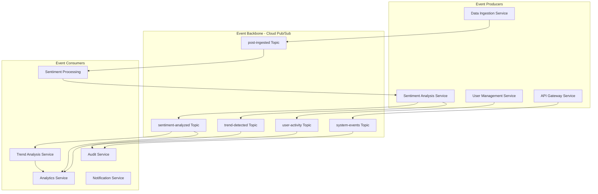
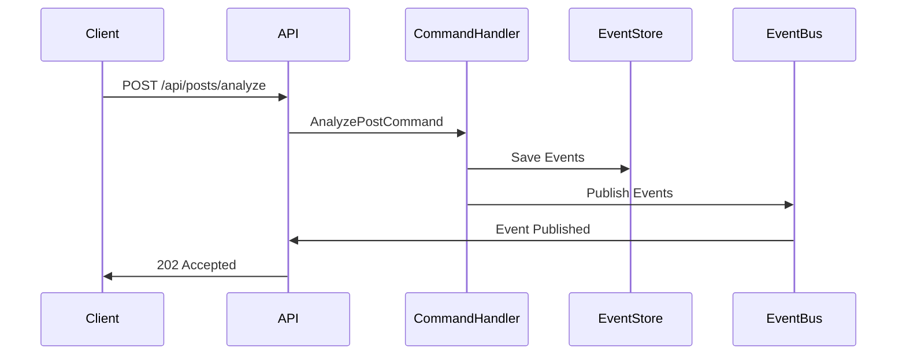
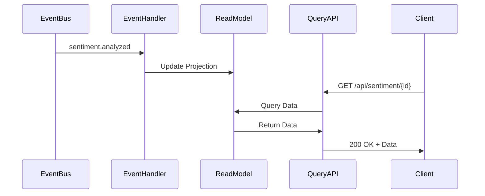
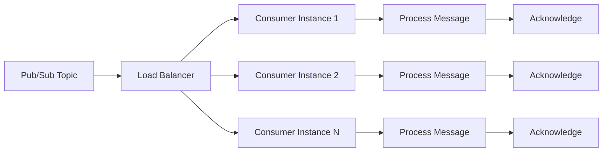
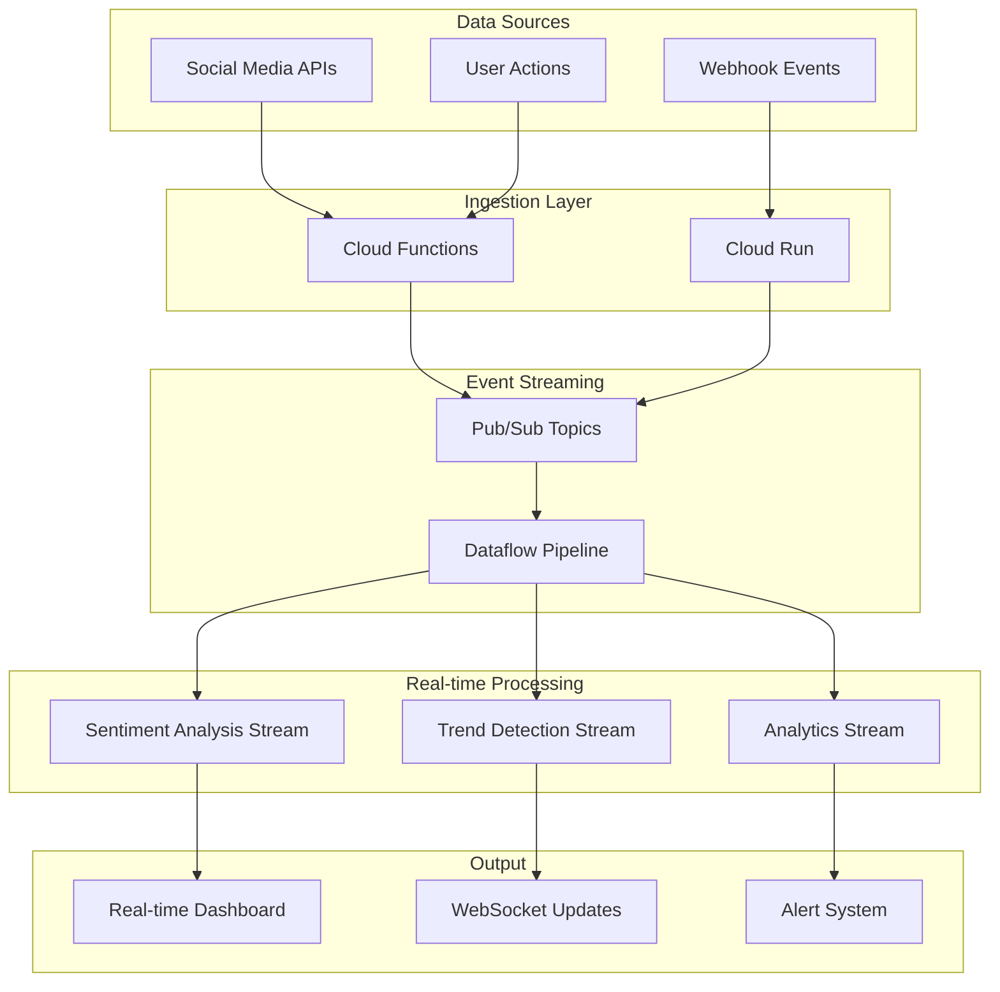

# Event-Driven Processing Architecture - Social Media Sentiment Analysis Platform

## Overview

This document defines the comprehensive event-driven processing architecture using Google Cloud Pub/Sub for the social media sentiment analysis platform. The architecture enables asynchronous, scalable, and resilient communication between microservices while maintaining data consistency and supporting real-time processing requirements.

## Event-Driven Design Principles

### 1. Core Principles

**Loose Coupling**: Services communicate through events without direct dependencies
**Temporal Decoupling**: Publishers and subscribers operate independently in time
**Event Immutability**: Events are immutable records of what happened
**Event Ordering**: Critical events maintain order where business logic requires it
**Idempotency**: Event handlers can safely process the same event multiple times

### 2. Architecture Patterns



## Pub/Sub Topic Architecture

### 1. Topic Organization Strategy

#### Core Business Events
```yaml
topics:
  # Data Ingestion Flow
  - name: "post-ingested"
    description: "New social media posts collected"
    retention: "7d"
    ordering_key: "platform"
    
  - name: "post-validated"
    description: "Posts that passed validation"
    retention: "24h"
    ordering_key: "post_id"
    
  # Sentiment Analysis Flow  
  - name: "sentiment-analysis-requested"
    description: "Posts queued for sentiment analysis"
    retention: "24h"
    ordering_key: "post_id"
    
  - name: "sentiment-analysis-completed"
    description: "Completed sentiment analysis results"
    retention: "7d"
    ordering_key: "post_id"
    
  # Trend Analysis Flow
  - name: "trend-calculation-triggered"
    description: "Trigger for trend recalculation"
    retention: "1h"
    ordering_key: "time_window"
    
  - name: "trend-detected"
    description: "New trending topics identified"
    retention: "7d"
    ordering_key: "keyword"
    
  # User Activity Flow
  - name: "user-activity"
    description: "User authentication and activity events"
    retention: "30d"
    ordering_key: "user_id"
    
  # System Events
  - name: "system-alerts"
    description: "System monitoring and alert events"
    retention: "30d"
    ordering_key: "severity"
```

#### Dead Letter Topics
```yaml
dead_letter_topics:
  - name: "post-ingested-dlq"
    max_delivery_attempts: 5
    ttl: "7d"
    
  - name: "sentiment-analysis-dlq"
    max_delivery_attempts: 3
    ttl: "24h"
    
  - name: "trend-analysis-dlq"
    max_delivery_attempts: 5
    ttl: "48h"
```

### 2. Message Schema Design

#### Base Event Schema
```json
{
  "$schema": "http://json-schema.org/draft-07/schema#",
  "type": "object",
  "required": ["eventId", "eventType", "eventTime", "source", "data"],
  "properties": {
    "eventId": {
      "type": "string",
      "format": "uuid",
      "description": "Unique identifier for this event"
    },
    "eventType": {
      "type": "string",
      "description": "Type of event (e.g., post.ingested, sentiment.analyzed)"
    },
    "eventTime": {
      "type": "string",
      "format": "date-time",
      "description": "When the event occurred (ISO 8601)"
    },
    "source": {
      "type": "string",
      "description": "Service that generated the event"
    },
    "correlationId": {
      "type": "string",
      "format": "uuid",
      "description": "ID to correlate related events"
    },
    "causationId": {
      "type": "string", 
      "format": "uuid",
      "description": "ID of the event that caused this event"
    },
    "version": {
      "type": "string",
      "description": "Schema version"
    },
    "data": {
      "type": "object",
      "description": "Event-specific payload"
    },
    "metadata": {
      "type": "object",
      "description": "Additional metadata"
    }
  }
}
```

#### Post Ingested Event
```json
{
  "eventId": "550e8400-e29b-41d4-a716-446655440000",
  "eventType": "post.ingested",
  "eventTime": "2024-01-15T10:30:00Z",
  "source": "ingestion-service",
  "correlationId": "550e8400-e29b-41d4-a716-446655440001",
  "version": "1.0",
  "data": {
    "postId": "550e8400-e29b-41d4-a716-446655440002",
    "content": "This new AI technology is absolutely amazing!",
    "platform": "reddit",
    "userId": "user123",
    "userName": "techEnthusiast",
    "timestamp": "2024-01-15T10:25:00Z",
    "sourceUrl": "https://reddit.com/r/technology/post/123",
    "sourceId": "reddit_post_123",
    "metadata": {
      "subreddit": "technology",
      "upvotes": 150,
      "downvotes": 5,
      "commentCount": 25
    }
  },
  "metadata": {
    "ingestionMethod": "scheduled",
    "processingPriority": "normal"
  }
}
```

#### Sentiment Analysis Completed Event
```json
{
  "eventId": "550e8400-e29b-41d4-a716-446655440003",
  "eventType": "sentiment.analyzed",
  "eventTime": "2024-01-15T10:30:30Z",
  "source": "sentiment-service",
  "correlationId": "550e8400-e29b-41d4-a716-446655440001",
  "causationId": "550e8400-e29b-41d4-a716-446655440000",
  "version": "1.0",
  "data": {
    "postId": "550e8400-e29b-41d4-a716-446655440002",
    "analysisId": "550e8400-e29b-41d4-a716-446655440004",
    "results": {
      "overallSentiment": "positive",
      "positiveScore": 0.85,
      "negativeScore": 0.05,
      "neutralScore": 0.10,
      "confidenceScore": 0.92,
      "isSarcastic": false,
      "sarcasmScore": 0.15
    },
    "extractedKeywords": ["AI", "technology", "amazing"],
    "extractedEntities": ["AI technology"],
    "modelVersion": "sentiment-v2.1",
    "processingTime": "00:00:00.250"
  },
  "metadata": {
    "modelInferenceTime": 180,
    "preprocessingTime": 45,
    "postprocessingTime": 25
  }
}
```

#### Trend Detected Event
```json
{
  "eventId": "550e8400-e29b-41d4-a716-446655440005",
  "eventType": "trend.detected",
  "eventTime": "2024-01-15T10:35:00Z",
  "source": "trends-service",
  "correlationId": "550e8400-e29b-41d4-a716-446655440006",
  "version": "1.0",
  "data": {
    "trendId": "550e8400-e29b-41d4-a716-446655440007",
    "keyword": "artificial intelligence",
    "platform": "reddit",
    "timeWindow": {
      "start": "2024-01-15T10:00:00Z",
      "end": "2024-01-15T10:30:00Z",
      "duration": "30m"
    },
    "metrics": {
      "trendScore": 0.95,
      "mentionCount": 1250,
      "avgSentimentScore": 0.75,
      "velocityScore": 0.88
    },
    "relatedKeywords": ["machine learning", "AI", "technology"],
    "sentimentDistribution": {
      "positive": 0.65,
      "neutral": 0.25,
      "negative": 0.10
    }
  },
  "metadata": {
    "calculationMethod": "sliding_window",
    "previousTrendScore": 0.72,
    "scoreChange": 0.23
  }
}
```

## Event Processing Patterns

### 1. Command Query Responsibility Segregation (CQRS)

#### Command Side (Write Model)


#### Query Side (Read Model)


### 2. Event Sourcing Implementation

#### Event Store Schema
```csharp
public class EventStore
{
    public Guid StreamId { get; set; }           // Aggregate ID
    public string StreamType { get; set; }       // Aggregate Type
    public int Version { get; set; }             // Event version in stream
    public string EventType { get; set; }        // Event type name
    public string EventData { get; set; }        // Serialized event data
    public string Metadata { get; set; }         // Event metadata
    public DateTime Timestamp { get; set; }      // When event was stored
    public Guid EventId { get; set; }           // Unique event identifier
    public string CorrelationId { get; set; }   // Correlation identifier
    public string CausationId { get; set; }     // Causation identifier
}
```

#### Event Sourcing Repository
```csharp
public class EventSourcingRepository<T> : IRepository<T> where T : AggregateRoot
{
    private readonly IEventStore _eventStore;
    private readonly IEventBus _eventBus;

    public async Task SaveAsync(T aggregate)
    {
        var events = aggregate.GetUncommittedEvents();
        
        foreach (var @event in events)
        {
            await _eventStore.SaveEventAsync(
                aggregate.Id,
                typeof(T).Name,
                @event.GetType().Name,
                JsonSerializer.Serialize(@event),
                @event.EventId,
                @event.CorrelationId,
                @event.CausationId
            );
            
            await _eventBus.PublishAsync(@event);
        }
        
        aggregate.MarkEventsAsCommitted();
    }

    public async Task<T> GetByIdAsync(Guid id)
    {
        var events = await _eventStore.GetEventsAsync(id);
        var aggregate = Activator.CreateInstance<T>();
        
        foreach (var eventData in events)
        {
            var eventType = Type.GetType(eventData.EventType);
            var @event = JsonSerializer.Deserialize(eventData.EventData, eventType);
            aggregate.LoadFromHistory(@event);
        }
        
        return aggregate;
    }
}
```

### 3. Saga Pattern for Long-Running Processes

#### Post Processing Saga
```csharp
public class PostProcessingSaga : ISaga
{
    public Guid Id { get; private set; }
    public PostProcessingState State { get; private set; } = PostProcessingState.Started;
    
    // Handle post ingested event
    public async Task Handle(PostIngestedEvent @event)
    {
        State = PostProcessingState.ValidationRequested;
        
        // Send validation command
        await _commandBus.SendAsync(new ValidatePostCommand
        {
            PostId = @event.PostId,
            SagaId = Id
        });
    }
    
    // Handle validation completed event
    public async Task Handle(PostValidatedEvent @event)
    {
        if (@event.IsValid)
        {
            State = PostProcessingState.SentimentAnalysisRequested;
            
            // Send sentiment analysis command
            await _commandBus.SendAsync(new AnalyzeSentimentCommand
            {
                PostId = @event.PostId,
                SagaId = Id
            });
        }
        else
        {
            State = PostProcessingState.Failed;
            // Handle validation failure
        }
    }
    
    // Handle sentiment analysis completed
    public async Task Handle(SentimentAnalyzedEvent @event)
    {
        State = PostProcessingState.TrendAnalysisRequested;
        
        // Trigger trend analysis
        await _eventBus.PublishAsync(new TrendCalculationTriggeredEvent
        {
            PostId = @event.PostId,
            Keywords = @event.ExtractedKeywords,
            SagaId = Id
        });
    }
    
    // Handle trend analysis completed
    public async Task Handle(TrendAnalysisCompletedEvent @event)
    {
        State = PostProcessingState.Completed;
        
        // Notify completion
        await _eventBus.PublishAsync(new PostProcessingCompletedEvent
        {
            PostId = @event.PostId,
            SagaId = Id,
            CompletedAt = DateTime.UtcNow
        });
    }
}

public enum PostProcessingState
{
    Started,
    ValidationRequested,
    SentimentAnalysisRequested,
    TrendAnalysisRequested,
    Completed,
    Failed
}
```

## Message Processing Patterns

### 1. Competing Consumers Pattern

#### Cloud Functions Configuration
```yaml
sentiment_analysis_consumer:
  source: "sentiment-analysis-requests"
  max_instances: 50
  min_instances: 2
  concurrency: 1
  ack_deadline: 300s
  retry_policy:
    max_attempts: 3
    initial_delay: 1s
    max_delay: 60s
    multiplier: 2.0
  dead_letter_topic: "sentiment-analysis-dlq"
```

#### Message Processing Flow


### 2. Message Deduplication Strategy

#### Idempotency Implementation
```csharp
public class IdempotentEventHandler : IEventHandler<SentimentAnalyzedEvent>
{
    private readonly IIdempotencyService _idempotencyService;
    private readonly ITrendAnalysisService _trendService;

    public async Task Handle(SentimentAnalyzedEvent @event)
    {
        var idempotencyKey = $"sentiment-analyzed-{@event.PostId}-{@event.EventId}";
        
        var result = await _idempotencyService.ExecuteOnceAsync(
            idempotencyKey,
            async () =>
            {
                await _trendService.UpdateTrendAsync(@event.PostId, @event.ExtractedKeywords);
                return "processed";
            },
            TimeSpan.FromHours(24)
        );
        
        if (result.IsFirstExecution)
        {
            // Log first-time processing
            _logger.LogInformation("Processed sentiment analysis for post {PostId}", @event.PostId);
        }
        else
        {
            // Log duplicate processing attempt
            _logger.LogWarning("Duplicate sentiment analysis event for post {PostId}", @event.PostId);
        }
    }
}
```

### 3. Error Handling and Retry Policies

#### Retry Configuration
```yaml
retry_policies:
  sentiment_analysis:
    max_attempts: 3
    initial_delay: "1s"
    max_delay: "60s"
    multiplier: 2.0
    jitter: true
    retryable_errors:
      - "DEADLINE_EXCEEDED"
      - "INTERNAL_ERROR"
      - "UNAVAILABLE"
    
  trend_calculation:
    max_attempts: 5
    initial_delay: "500ms"
    max_delay: "30s"
    multiplier: 1.5
    retryable_errors:
      - "RESOURCE_EXHAUSTED"
      - "UNAVAILABLE"
      
  user_notifications:
    max_attempts: 10
    initial_delay: "100ms"
    max_delay: "300s"
    multiplier: 2.0
    circuit_breaker:
      failure_threshold: 5
      recovery_timeout: "60s"
```

#### Dead Letter Queue Handler
```csharp
public class DeadLetterQueueHandler : IEventHandler<DeadLetterEvent>
{
    private readonly ILogger<DeadLetterQueueHandler> _logger;
    private readonly IAlertService _alertService;
    private readonly IEventStore _eventStore;

    public async Task Handle(DeadLetterEvent @event)
    {
        // Log the failure
        _logger.LogError("Message sent to DLQ: {EventType} - {EventId} - {FailureReason}", 
            @event.OriginalEventType, @event.OriginalEventId, @event.FailureReason);
        
        // Store for manual analysis
        await _eventStore.SaveDeadLetterEventAsync(@event);
        
        // Alert operations team for critical events
        if (IsCriticalEvent(@event.OriginalEventType))
        {
            await _alertService.SendCriticalAlertAsync(
                $"Critical event in DLQ: {@event.OriginalEventType}",
                @event.FailureReason
            );
        }
        
        // Attempt automated recovery for known issues
        await AttemptAutomatedRecovery(@event);
    }

    private async Task AttemptAutomatedRecovery(DeadLetterEvent @event)
    {
        switch (@event.FailureReason)
        {
            case "TIMEOUT":
                // Retry with increased timeout
                await _eventBus.PublishAsync(@event.OriginalEvent, new PublishOptions
                {
                    Timeout = TimeSpan.FromMinutes(10)
                });
                break;
                
            case "INVALID_DATA":
                // Attempt data cleaning and retry
                var cleanedEvent = await _dataCleaningService.CleanEventData(@event.OriginalEvent);
                if (cleanedEvent != null)
                {
                    await _eventBus.PublishAsync(cleanedEvent);
                }
                break;
        }
    }
}
```

## Real-Time Processing Pipeline

### 1. Stream Processing Architecture



### 2. Streaming Data Processing

#### Dataflow Pipeline Configuration
```python
import apache_beam as beam
from apache_beam.options.pipeline_options import PipelineOptions

def create_sentiment_stream_pipeline():
    pipeline_options = PipelineOptions([
        '--project=sentiment-analysis-project',
        '--job_name=sentiment-stream-processing',
        '--region=us-central1',
        '--runner=DataflowRunner',
        '--streaming=true',
        '--max_num_workers=20',
        '--autoscaling_algorithm=THROUGHPUT_BASED'
    ])
    
    with beam.Pipeline(options=pipeline_options) as pipeline:
        sentiment_events = (
            pipeline
            | 'Read from Pub/Sub' >> beam.io.ReadFromPubSub(
                topic='projects/sentiment-analysis-project/topics/sentiment-analysis-completed'
            )
            | 'Parse JSON' >> beam.Map(parse_sentiment_event)
            | 'Extract Keywords' >> beam.Map(extract_keywords)
            | 'Window by Time' >> beam.WindowInto(
                beam.window.FixedWindows(size=300)  # 5-minute windows
            )
            | 'Group by Keyword' >> beam.GroupByKey()
            | 'Calculate Trends' >> beam.Map(calculate_trend_score)
            | 'Filter Significant Trends' >> beam.Filter(
                lambda trend: trend.score > 0.7
            )
            | 'Publish Trends' >> beam.io.WriteToPubSub(
                topic='projects/sentiment-analysis-project/topics/trend-detected'
            )
        )

def parse_sentiment_event(message):
    import json
    return json.loads(message.decode('utf-8'))

def extract_keywords(event):
    return {
        'timestamp': event['eventTime'],
        'keywords': event['data']['extractedKeywords'],
        'sentiment': event['data']['results']['overallSentiment'],
        'platform': event['data']['platform']
    }

def calculate_trend_score(keyword_group):
    keyword, events = keyword_group
    
    total_mentions = len(events)
    positive_sentiment = sum(1 for e in events if e['sentiment'] == 'positive')
    
    trend_score = (total_mentions * 0.7) + (positive_sentiment / total_mentions * 0.3)
    
    return {
        'keyword': keyword,
        'score': min(trend_score / 100, 1.0),  # Normalize to 0-1
        'mentions': total_mentions,
        'sentiment_ratio': positive_sentiment / total_mentions,
        'timestamp': max(e['timestamp'] for e in events)
    }
```

### 3. Event Replay and Recovery

#### Event Replay Service
```csharp
public class EventReplayService : IEventReplayService
{
    private readonly IEventStore _eventStore;
    private readonly IEventBus _eventBus;
    private readonly ILogger<EventReplayService> _logger;

    public async Task ReplayEventsAsync(
        DateTime fromTime, 
        DateTime toTime, 
        string eventType = null,
        Func<Event, bool> filter = null)
    {
        var events = await _eventStore.GetEventsAsync(fromTime, toTime, eventType);
        
        if (filter != null)
        {
            events = events.Where(filter);
        }
        
        var batchSize = 100;
        var eventBatches = events.Batch(batchSize);
        
        foreach (var batch in eventBatches)
        {
            var replayTasks = batch.Select(async @event =>
            {
                try
                {
                    // Mark as replay event
                    @event.Metadata["IsReplay"] = true;
                    @event.Metadata["ReplayTime"] = DateTime.UtcNow;
                    
                    await _eventBus.PublishAsync(@event);
                    
                    _logger.LogInformation("Replayed event {EventId} of type {EventType}", 
                        @event.EventId, @event.EventType);
                }
                catch (Exception ex)
                {
                    _logger.LogError(ex, "Failed to replay event {EventId}", @event.EventId);
                }
            });
            
            await Task.WhenAll(replayTasks);
            
            // Add delay between batches to avoid overwhelming consumers
            await Task.Delay(TimeSpan.FromSeconds(1));
        }
    }

    public async Task ReplayFailedEventsAsync(DateTime fromTime, DateTime toTime)
    {
        var failedEvents = await _eventStore.GetFailedEventsAsync(fromTime, toTime);
        
        foreach (var failedEvent in failedEvents)
        {
            // Attempt to fix common issues before replay
            var fixedEvent = await AttemptEventRepair(failedEvent);
            
            if (fixedEvent != null)
            {
                await _eventBus.PublishAsync(fixedEvent);
                await _eventStore.MarkEventAsReplayedAsync(failedEvent.EventId);
            }
        }
    }
}
```

## Performance Optimization

### 1. Message Batching

#### Batch Processing Configuration
```yaml
batch_settings:
  sentiment_analysis:
    max_messages: 1000
    max_latency: "10s"
    max_bytes: "10MB"
    
  trend_calculation:
    max_messages: 500
    max_latency: "30s"
    max_bytes: "5MB"
    
  notifications:
    max_messages: 100
    max_latency: "5s"
    max_bytes: "1MB"
```

### 2. Message Compression

```csharp
public class CompressedEventPublisher : IEventPublisher
{
    public async Task PublishAsync<T>(T @event) where T : IDomainEvent
    {
        var serialized = JsonSerializer.Serialize(@event);
        var compressed = await GZipCompress(serialized);
        
        var message = new PubsubMessage
        {
            Data = Google.Protobuf.ByteString.CopyFrom(compressed),
            Attributes = {
                ["eventType"] = typeof(T).Name,
                ["compression"] = "gzip",
                ["originalSize"] = serialized.Length.ToString()
            }
        };
        
        await _publisher.PublishAsync(message);
    }
    
    private async Task<byte[]> GZipCompress(string text)
    {
        using var output = new MemoryStream();
        using var gzip = new GZipStream(output, CompressionLevel.Optimal);
        using var writer = new StreamWriter(gzip, Encoding.UTF8);
        
        await writer.WriteAsync(text);
        await writer.FlushAsync();
        
        return output.ToArray();
    }
}
```

## Monitoring and Observability

### 1. Event Metrics

```yaml
event_metrics:
  - name: "events_published_total"
    type: "counter"
    labels: ["event_type", "topic", "source_service"]
    
  - name: "events_consumed_total"
    type: "counter"
    labels: ["event_type", "topic", "consumer_service"]
    
  - name: "event_processing_duration_seconds"
    type: "histogram"
    labels: ["event_type", "consumer_service"]
    
  - name: "dead_letter_events_total"
    type: "counter"
    labels: ["event_type", "failure_reason"]
    
  - name: "event_lag_seconds"
    type: "gauge"
    description: "Time between event creation and processing"
    labels: ["topic", "subscription"]
```

### 2. Event Tracing

```csharp
public class TracingEventHandler<T> : IEventHandler<T> where T : IDomainEvent
{
    private readonly IEventHandler<T> _innerHandler;
    private readonly ITracer _tracer;

    public async Task Handle(T @event)
    {
        using var activity = _tracer.StartActivity($"EventHandler.{typeof(T).Name}");
        
        activity?.SetTag("event.id", @event.EventId.ToString());
        activity?.SetTag("event.type", typeof(T).Name);
        activity?.SetTag("event.correlation_id", @event.CorrelationId?.ToString());
        
        try
        {
            await _innerHandler.Handle(@event);
            activity?.SetStatus(ActivityStatusCode.Ok);
        }
        catch (Exception ex)
        {
            activity?.SetStatus(ActivityStatusCode.Error, ex.Message);
            activity?.RecordException(ex);
            throw;
        }
    }
}
```

This comprehensive event-driven architecture provides a robust foundation for asynchronous, scalable communication between microservices while ensuring reliability, consistency, and observability throughout the social media sentiment analysis platform.