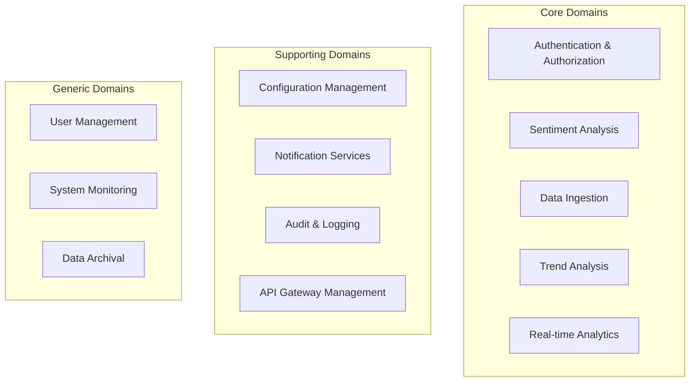
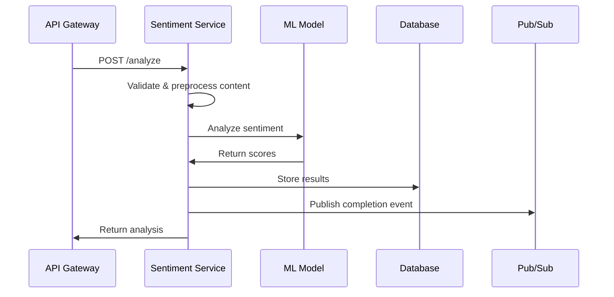
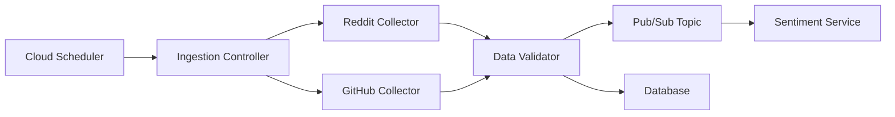
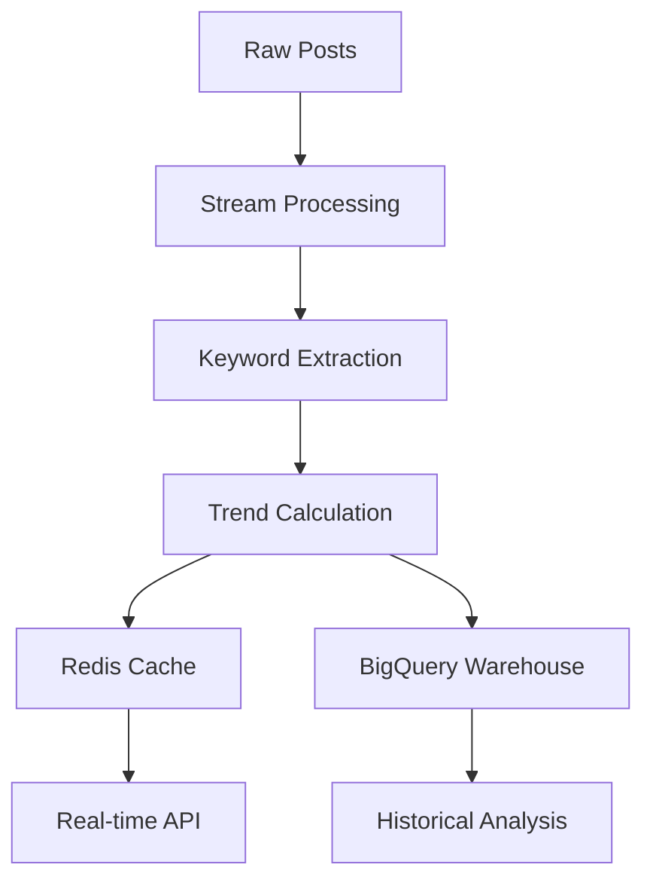
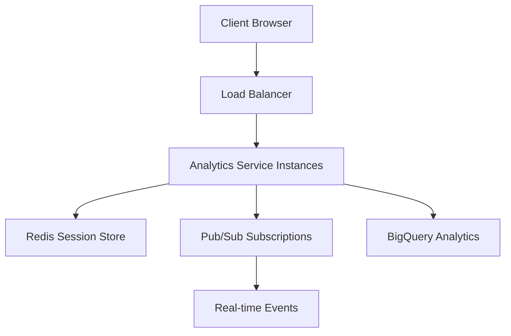
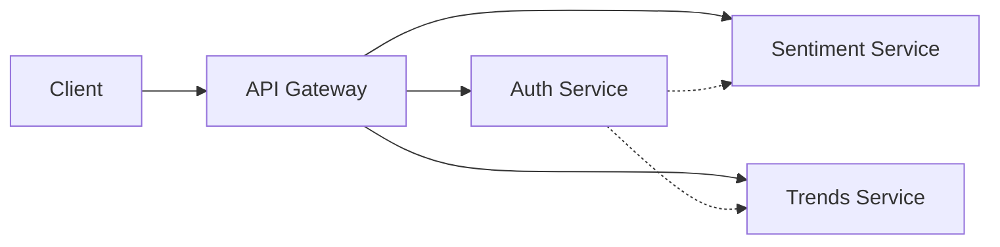
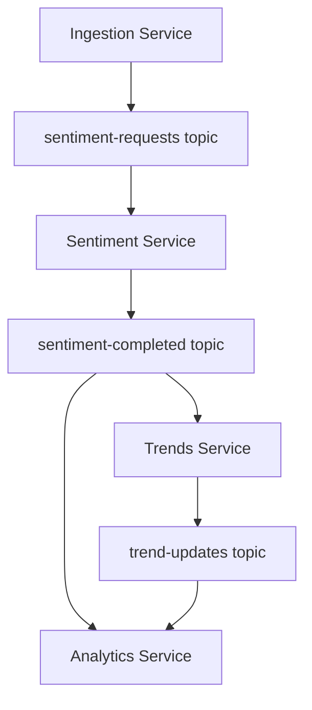

# Microservices Architecture - Social Media Sentiment Analysis Platform

## Overview

This document defines the microservices architecture for the social media sentiment analysis platform using Google Cloud Functions, Cloud Run, and supporting GCP services. The architecture follows Domain-Driven Design (DDD) principles with clear service boundaries and event-driven communication.

## Service Decomposition Strategy

### 1. Business Domain Analysis



### 2. Service Boundaries

Each microservice owns its data and business logic, communicating through well-defined APIs and events.

## Core Microservices

### 1. Authentication Service (`auth-service`)

**Purpose**: Handle user authentication, authorization, and JWT token management.

**Technology Stack**:
- **Runtime**: Cloud Functions (Node.js/C#)
- **Database**: Cloud Firestore (user sessions)
- **Cache**: Cloud Memorystore (Redis)
- **Security**: Cloud Identity & Access Management

**Responsibilities**:
- User login/logout operations
- JWT token generation and validation
- OAuth 2.0 integration
- Session management
- Role-based access control (RBAC)

**API Endpoints**:
```yaml
paths:
  /auth/login:
    post: # Authenticate user
  /auth/logout:
    post: # Invalidate session
  /auth/refresh:
    post: # Refresh JWT token
  /auth/validate:
    post: # Validate token (internal)
  /auth/permissions:
    get: # Get user permissions
```

**Cloud Function Configuration**:
```yaml
name: auth-service
runtime: dotnet6
memory: 256MB
timeout: 60s
environment_variables:
  JWT_SECRET: ${secret:jwt-secret}
  DB_CONNECTION: ${secret:firestore-connection}
trigger:
  httpsTrigger: {}
```

### 2. Sentiment Analysis Service (`sentiment-service`)

**Purpose**: Core ML-powered sentiment analysis of social media content.

**Technology Stack**:
- **Runtime**: Cloud Functions (C# with ML.NET)
- **ML Platform**: Vertex AI + ML.NET hybrid
- **Database**: Cloud SQL (PostgreSQL)
- **Message Queue**: Cloud Pub/Sub
- **Storage**: Cloud Storage (model artifacts)

**Responsibilities**:
- Single post sentiment analysis
- Batch processing coordination
- ML model management and versioning
- Sarcasm detection
- Keyword and entity extraction

**Processing Flow**:


**Cloud Function Configuration**:
```yaml
name: sentiment-analysis
runtime: dotnet6
memory: 1GB
timeout: 300s
environment_variables:
  MODEL_PATH: gs://sentiment-models/latest
  DB_CONNECTION: ${secret:postgres-connection}
trigger:
  httpsTrigger: {}
  pubsubTrigger:
    topic: sentiment-analysis-requests
```

### 3. Data Ingestion Service (`ingestion-service`)

**Purpose**: Collect and process social media data from external sources.

**Technology Stack**:
- **Runtime**: Cloud Functions + Cloud Run (long-running tasks)
- **Scheduler**: Cloud Scheduler
- **Database**: Cloud SQL (PostgreSQL)
- **Message Queue**: Cloud Pub/Sub
- **API Clients**: Reddit API, GitHub API

**Responsibilities**:
- Scheduled data collection from Reddit
- GitHub dataset processing
- Data validation and deduplication
- Rate limiting and API quota management
- Data quality monitoring

**Architecture Pattern**:


**Service Components**:

#### Ingestion Controller Function
```yaml
name: ingestion-controller
runtime: dotnet6
memory: 256MB
timeout: 540s
trigger:
  httpsTrigger: {}
  scheduleTrigger:
    schedule: "*/5 * * * *" # Every 5 minutes
```

#### Reddit Collector Function
```yaml
name: reddit-collector
runtime: dotnet6
memory: 512MB
timeout: 540s
environment_variables:
  REDDIT_CLIENT_ID: ${secret:reddit-client-id}
  REDDIT_CLIENT_SECRET: ${secret:reddit-client-secret}
trigger:
  pubsubTrigger:
    topic: reddit-collection-requests
```

### 4. Trend Analysis Service (`trends-service`)

**Purpose**: Real-time trend detection and analysis across platforms.

**Technology Stack**:
- **Runtime**: Cloud Functions + Cloud Run
- **Analytics**: BigQuery (data warehouse)
- **Cache**: Cloud Memorystore (Redis)
- **Storage**: Cloud Storage (historical data)

**Responsibilities**:
- Real-time trend calculation
- Historical trend analysis
- Keyword correlation analysis
- Geographic trend mapping
- Trend prediction algorithms

**Data Processing Pipeline**:


**Cloud Function Configuration**:
```yaml
name: trends-calculator
runtime: dotnet6
memory: 1GB
timeout: 300s
environment_variables:
  BIGQUERY_PROJECT: sentiment-analysis-project
  REDIS_HOST: ${secret:redis-host}
trigger:
  pubsubTrigger:
    topic: sentiment-analysis-completed
```

### 5. Real-time Analytics Service (`analytics-service`)

**Purpose**: Live dashboard data and WebSocket communication.

**Technology Stack**:
- **Runtime**: Cloud Run (persistent WebSocket connections)
- **Database**: Cloud Memorystore (Redis)
- **Analytics**: BigQuery
- **Messaging**: Cloud Pub/Sub

**Responsibilities**:
- WebSocket connection management
- Real-time metric aggregation
- Dashboard data compilation
- Alert generation and notification
- Performance monitoring

**WebSocket Architecture**:


**Cloud Run Configuration**:
```yaml
apiVersion: serving.knative.dev/v1
kind: Service
metadata:
  name: analytics-service
spec:
  template:
    metadata:
      annotations:
        autoscaling.knative.dev/minScale: "2"
        autoscaling.knative.dev/maxScale: "100"
    spec:
      containers:
      - image: gcr.io/project/analytics-service:latest
        resources:
          limits:
            memory: "1Gi"
            cpu: "1000m"
        env:
        - name: REDIS_CONNECTION
          valueFrom:
            secretKeyRef:
              name: redis-connection
              key: connection-string
```

### 6. Configuration Service (`config-service`)

**Purpose**: Centralized configuration and feature flag management.

**Technology Stack**:
- **Runtime**: Cloud Functions
- **Storage**: Cloud Firestore
- **Cache**: Cloud Memorystore

**Responsibilities**:
- Platform configuration management
- Feature flag controls
- Rate limiting configurations
- ML model version management
- Environment-specific settings

## Supporting Services

### 1. API Gateway Service

**Implementation**: Cloud Endpoints + Cloud Load Balancer

**Responsibilities**:
- Request routing and load balancing
- Authentication and authorization
- Rate limiting enforcement
- Request/response transformation
- API versioning management
- Monitoring and logging

**Configuration Example**:
```yaml
swagger: "2.0"
info:
  title: "Sentiment Analysis API"
  version: "1.0.0"
host: "api.sentiment-platform.com"
schemes:
  - "https"
securityDefinitions:
  api_key:
    type: "apiKey"
    name: "X-API-Key"
    in: "header"
  firebase:
    authorizationUrl: ""
    flow: "implicit"
    type: "oauth2"
    x-google-issuer: "https://securetoken.google.com/PROJECT_ID"
    x-google-jwks_uri: "https://www.googleapis.com/service_accounts/v1/jwk/securetoken@system.gserviceaccount.com"
```

### 2. Notification Service

**Purpose**: Handle alerts, webhooks, and user notifications.

**Technology Stack**:
- **Runtime**: Cloud Functions
- **Email**: SendGrid API
- **Push Notifications**: Firebase Cloud Messaging
- **Webhooks**: HTTP clients

### 3. Audit Service

**Purpose**: Comprehensive audit logging and compliance.

**Technology Stack**:
- **Runtime**: Cloud Functions
- **Storage**: Cloud Logging + BigQuery
- **Monitoring**: Cloud Monitoring

## Inter-Service Communication

### 1. Synchronous Communication

**API Gateway Pattern**: All external requests go through the API Gateway
**Service-to-Service**: Direct HTTPS calls for real-time operations



### 2. Asynchronous Communication

**Event-Driven Architecture**: Pub/Sub topics for loose coupling

**Key Topics**:
- `sentiment-analysis-requests`: New posts to analyze
- `sentiment-analysis-completed`: Analysis results
- `trend-updates`: New trend calculations
- `user-activity`: Authentication and user events
- `system-alerts`: Monitoring and health events



### 3. Data Consistency Patterns

**Saga Pattern**: For multi-service transactions
**Event Sourcing**: For audit and replay capabilities
**CQRS**: Separate read/write models for performance

## Deployment Architecture

### 1. Environment Strategy

**Development**:
- Single Cloud Project
- Shared resources with namespacing
- Local development with emulators

**Staging**:
- Separate Cloud Project
- Production-like configuration
- Automated testing pipeline

**Production**:
- Dedicated Cloud Project
- High availability configuration
- Multi-region deployment

### 2. Resource Organization

```
GCP Organization
├── sentiment-analysis-dev
│   ├── Cloud Functions
│   ├── Cloud Run
│   ├── Cloud SQL (dev instance)
│   └── Cloud Storage (dev buckets)
├── sentiment-analysis-staging
│   ├── Cloud Functions
│   ├── Cloud Run
│   ├── Cloud SQL (staging instance)
│   └── Cloud Storage (staging buckets)
└── sentiment-analysis-prod
    ├── Cloud Functions (multi-region)
    ├── Cloud Run (multi-region)
    ├── Cloud SQL (HA configuration)
    └── Cloud Storage (multi-region)
```

### 3. Infrastructure as Code

**Terraform Configuration Structure**:
```
infrastructure/
├── modules/
│   ├── cloud-functions/
│   ├── cloud-run/
│   ├── cloud-sql/
│   ├── pubsub/
│   └── monitoring/
├── environments/
│   ├── dev/
│   ├── staging/
│   └── prod/
└── shared/
    ├── networking/
    ├── security/
    └── dns/
```

## Monitoring & Observability

### 1. Service Health Monitoring

**Health Check Endpoints**:
- `/health` - Basic service health
- `/ready` - Readiness for traffic
- `/metrics` - Prometheus-compatible metrics

**Key Metrics**:
- Request latency (P50, P95, P99)
- Error rates by service
- Queue depths and processing times
- Resource utilization

### 2. Distributed Tracing

**Implementation**: Cloud Trace integration
**Trace Propagation**: HTTP headers and Pub/Sub attributes
**Custom Spans**: Business logic tracing

### 3. Centralized Logging

**Log Aggregation**: Cloud Logging
**Log Structure**: Structured JSON logging
**Log Correlation**: Request IDs and trace IDs

## Security Considerations

### 1. Network Security

**VPC Configuration**: Private subnets for databases
**Firewall Rules**: Minimal required access
**Service Mesh**: Istio for service-to-service encryption

### 2. Identity & Access Management

**Service Accounts**: Least privilege principle
**IAM Policies**: Fine-grained permissions
**Secret Management**: Cloud Secret Manager

### 3. Data Protection

**Encryption**: At rest and in transit
**PII Handling**: Data anonymization
**Compliance**: GDPR and data retention policies

## Scaling Strategy

### 1. Auto-scaling Configuration

**Cloud Functions**:
- Concurrent executions: 1000 per function
- Memory allocation: Based on workload
- Timeout optimization: Minimize cold starts

**Cloud Run**:
- Min instances: 2 for critical services
- Max instances: 100 with burst protection
- CPU throttling: Prevent resource exhaustion

### 2. Performance Optimization

**Caching Strategy**:
- L1: Application-level caching
- L2: Redis distributed cache
- L3: CDN for static content

**Database Optimization**:
- Read replicas for query distribution
- Connection pooling
- Query optimization and indexing

This microservices architecture provides a scalable, maintainable, and resilient foundation for the social media sentiment analysis platform, leveraging GCP's managed services for operational efficiency while maintaining clear service boundaries and communication patterns.