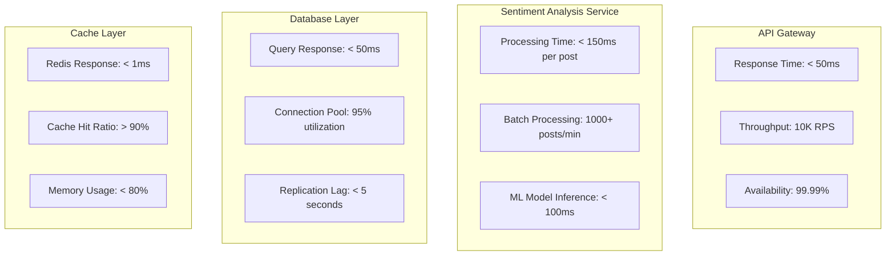
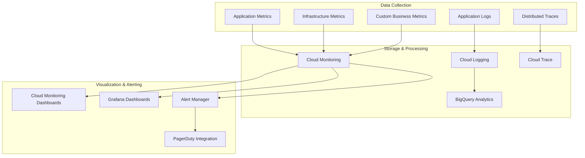
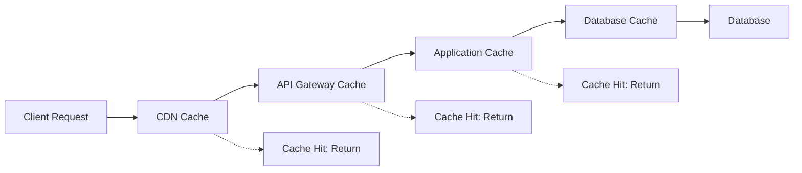
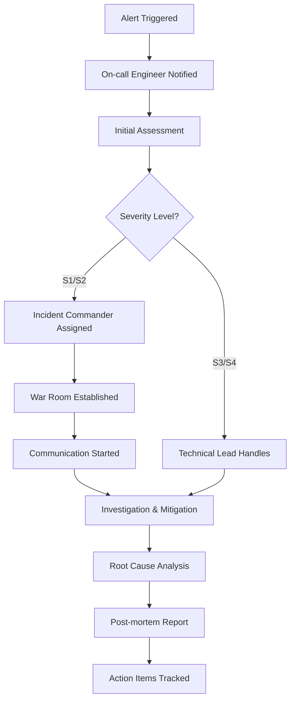

# Performance and Monitoring Strategy - Social Media Sentiment Analysis Platform

## Overview

This document outlines the comprehensive performance and monitoring strategy for the social media sentiment analysis platform, designed to achieve the target performance requirements of 1000+ posts/minute processing, sub-200ms API response times, and 99.9% uptime SLA.

## Performance Requirements

### 1. Service Level Objectives (SLOs)

| Metric | Target | Measurement Window | Consequences |
|--------|--------|-------------------|--------------|
| **API Response Time** | 95% < 200ms, 99% < 500ms | 1 hour rolling | Alert if breached for 5 minutes |
| **System Availability** | 99.9% uptime | Monthly | SLA credit if breached |
| **Processing Throughput** | 1000+ posts/minute | 5-minute average | Auto-scale triggers |
| **Error Rate** | < 0.1% | 1 hour rolling | Immediate alert if > 0.5% |
| **Queue Processing Time** | 95% processed within 30 seconds | Real-time | Alert if backlog > 1000 items |

### 2. Performance Targets by Component



## Observability Architecture

### 1. Three Pillars of Observability

#### Metrics
- **Infrastructure Metrics**: CPU, memory, network, disk I/O
- **Application Metrics**: Request rates, response times, error rates
- **Business Metrics**: Posts processed, sentiment accuracy, trend detection rate

#### Logs
- **Structured Logging**: JSON format with correlation IDs
- **Centralized Collection**: Cloud Logging with BigQuery export
- **Log Retention**: 30 days hot, 1 year archive

#### Traces
- **Distributed Tracing**: Cloud Trace integration
- **Request Flow Visualization**: End-to-end request tracking
- **Performance Bottleneck Identification**: Slow span detection

### 2. Monitoring Stack



## Key Performance Indicators (KPIs)

### 1. Application Performance Metrics

#### API Gateway Metrics
```json
{
  "metrics": [
    {
      "name": "api_request_duration_seconds",
      "type": "histogram",
      "description": "API request duration in seconds",
      "labels": ["method", "endpoint", "status_code"]
    },
    {
      "name": "api_requests_total",
      "type": "counter", 
      "description": "Total API requests",
      "labels": ["method", "endpoint", "status_code"]
    },
    {
      "name": "api_concurrent_requests",
      "type": "gauge",
      "description": "Current concurrent API requests"
    }
  ]
}
```

#### Sentiment Analysis Metrics
```json
{
  "metrics": [
    {
      "name": "sentiment_analysis_duration_seconds",
      "type": "histogram",
      "description": "Sentiment analysis processing time",
      "labels": ["model_version", "content_length_bucket"]
    },
    {
      "name": "sentiment_analysis_accuracy",
      "type": "gauge",
      "description": "Model accuracy score",
      "labels": ["model_version"]
    },
    {
      "name": "sentiment_queue_depth",
      "type": "gauge",
      "description": "Number of posts waiting for analysis"
    }
  ]
}
```

### 2. Infrastructure Metrics

#### Cloud Functions Metrics
```yaml
metrics:
  - name: function_execution_count
    filter: resource.type="cloud_function"
    aggregation:
      alignmentPeriod: 60s
      perSeriesAligner: ALIGN_RATE
      crossSeriesReducer: REDUCE_SUM
      
  - name: function_execution_times
    filter: resource.type="cloud_function"
    aggregation:
      alignmentPeriod: 60s
      perSeriesAligner: ALIGN_DELTA
      crossSeriesReducer: REDUCE_MEAN
      
  - name: function_memory_usage
    filter: resource.type="cloud_function"
    aggregation:
      alignmentPeriod: 60s
      perSeriesAligner: ALIGN_MEAN
      crossSeriesReducer: REDUCE_MAX
```

#### Database Performance Metrics
```yaml
metrics:
  - name: cloudsql_database_cpu_utilization
    description: "Database CPU utilization percentage"
    threshold: 80
    
  - name: cloudsql_database_memory_utilization  
    description: "Database memory utilization percentage"
    threshold: 85
    
  - name: cloudsql_database_disk_utilization
    description: "Database disk utilization percentage"
    threshold: 90
    
  - name: cloudsql_database_connection_count
    description: "Active database connections"
    threshold: 400
```

## Monitoring Dashboards

### 1. Executive Dashboard

**Purpose**: High-level system health for business stakeholders

**Key Widgets**:
- System availability percentage (current month)
- Posts processed today vs. yesterday
- Average response time trend (24 hours)
- Revenue impact of downtime
- Customer satisfaction score

### 2. Operations Dashboard

**Purpose**: Real-time system monitoring for operations team

```yaml
dashboard:
  name: "Sentiment Analysis Operations"
  time_range: "1h"
  refresh_interval: "30s"
  
  panels:
    - title: "API Response Times"
      type: "graph"
      targets:
        - query: "histogram_quantile(0.95, api_request_duration_seconds)"
          legend: "95th percentile"
        - query: "histogram_quantile(0.99, api_request_duration_seconds)"
          legend: "99th percentile"
      thresholds:
        - value: 200
          color: "yellow"
        - value: 500
          color: "red"
          
    - title: "Request Rate"
      type: "graph"
      targets:
        - query: "rate(api_requests_total[5m])"
          legend: "Requests per second"
          
    - title: "Error Rate"
      type: "stat"
      targets:
        - query: "rate(api_requests_total{status_code=~'5..'}[5m]) / rate(api_requests_total[5m]) * 100"
          legend: "Error percentage"
      thresholds:
        - value: 0.1
          color: "yellow"
        - value: 1.0
          color: "red"
          
    - title: "Queue Depth"
      type: "graph"
      targets:
        - query: "sentiment_queue_depth"
          legend: "Posts awaiting analysis"
      thresholds:
        - value: 500
          color: "yellow"
        - value: 1000
          color: "red"
```

### 3. Performance Dashboard

**Purpose**: Detailed performance analysis for engineering team

**Key Sections**:
- **Request Flow**: End-to-end latency breakdown
- **Resource Utilization**: CPU, memory, disk, network usage
- **Database Performance**: Query performance, connection pooling
- **Cache Performance**: Hit ratios, eviction rates
- **ML Model Performance**: Inference times, accuracy metrics

### 4. Business Intelligence Dashboard

**Purpose**: Business metrics and trend analysis

**Key Widgets**:
- Sentiment distribution over time
- Trending topics and keywords
- Platform comparison (Reddit vs. Twitter)
- Geographic sentiment analysis
- Model accuracy trends

## Alerting Strategy

### 1. Alert Severity Levels

| Severity | Response Time | Escalation | Examples |
|----------|---------------|------------|----------|
| **Critical** | Immediate | Page on-call engineer | System down, data loss risk |
| **High** | 5 minutes | Slack notification + Email | SLA breach, high error rate |
| **Medium** | 15 minutes | Email notification | Performance degradation |
| **Low** | 1 hour | Daily digest | Capacity warnings |

### 2. Alert Definitions

#### Critical Alerts
```yaml
alerts:
  - name: "SystemDown"
    condition: "up == 0"
    duration: "30s"
    severity: "critical"
    annotations:
      summary: "Service {{ $labels.instance }} is down"
      description: "{{ $labels.instance }} has been down for more than 30 seconds"
    
  - name: "HighErrorRate"
    condition: "rate(http_requests_total{code=~'5..'}[5m]) > 0.05"
    duration: "2m"
    severity: "critical"
    annotations:
      summary: "High error rate detected"
      description: "Error rate is {{ $value }}% over the last 5 minutes"

  - name: "DatabaseDown"
    condition: "cloudsql_up == 0"
    duration: "30s"
    severity: "critical"
    annotations:
      summary: "Database is unreachable"
      description: "Cannot connect to Cloud SQL instance"
```

#### High Priority Alerts
```yaml
alerts:
  - name: "HighLatency"
    condition: "histogram_quantile(0.95, api_request_duration_seconds) > 0.2"
    duration: "5m"
    severity: "high"
    annotations:
      summary: "High API latency detected"
      description: "95th percentile latency is {{ $value }}s"
      
  - name: "QueueBacklog"
    condition: "sentiment_queue_depth > 1000"
    duration: "2m"
    severity: "high"
    annotations:
      summary: "Sentiment analysis queue backlog"
      description: "{{ $value }} posts waiting for analysis"
```

### 3. Alert Routing

```yaml
route:
  group_by: ['alertname']
  group_wait: 10s
  group_interval: 10s
  repeat_interval: 1h
  receiver: 'default'
  
  routes:
  - match:
      severity: critical
    receiver: 'pagerduty-critical'
    
  - match:
      severity: high
    receiver: 'slack-alerts'
    
  - match:
      severity: medium
    receiver: 'email-team'
    
receivers:
- name: 'pagerduty-critical'
  pagerduty_configs:
  - service_key: '<pagerduty-service-key>'
    
- name: 'slack-alerts'
  slack_configs:
  - api_url: '<slack-webhook-url>'
    channel: '#alerts'
    
- name: 'email-team'
  email_configs:
  - to: 'team@company.com'
    subject: 'Alert: {{ .GroupLabels.alertname }}'
```

## Performance Optimization Strategies

### 1. Caching Strategy

#### Multi-Level Caching


#### Cache Configuration
```yaml
cache_policies:
  - name: "sentiment_results"
    ttl: "1h"
    key_pattern: "sentiment:post:{post_id}"
    max_memory: "500MB"
    eviction_policy: "LRU"
    
  - name: "trend_data"
    ttl: "5m"
    key_pattern: "trends:{platform}:{timewindow}"
    max_memory: "200MB"
    eviction_policy: "TTL"
    
  - name: "user_sessions"
    ttl: "24h"
    key_pattern: "session:{user_id}"
    max_memory: "100MB"
    eviction_policy: "LRU"
```

### 2. Database Optimization

#### Query Optimization
```sql
-- Optimized sentiment analysis lookup
CREATE INDEX CONCURRENTLY idx_posts_platform_timestamp 
ON social_media_posts (platform, timestamp DESC) 
WHERE status = 'completed';

-- Optimized trending query
CREATE INDEX CONCURRENTLY idx_trends_keyword_timewindow
ON trend_analysis (keyword, time_window_start DESC)
INCLUDE (trend_score, mention_count);

-- Composite index for dashboard queries
CREATE INDEX CONCURRENTLY idx_sentiment_analysis_compound
ON sentiment_analysis (analyzed_at DESC, overall_sentiment)
INCLUDE (confidence_score, positive_score);
```

#### Connection Pooling
```yaml
database:
  max_connections: 400
  pool_config:
    min_size: 10
    max_size: 50
    acquire_timeout: 30s
    idle_timeout: 600s
    max_lifetime: 1800s
    health_check_interval: 30s
```

### 3. Auto-Scaling Configuration

#### Horizontal Pod Autoscaler
```yaml
apiVersion: autoscaling/v2
kind: HorizontalPodAutoscaler
metadata:
  name: sentiment-api-hpa
spec:
  scaleTargetRef:
    apiVersion: apps/v1
    kind: Deployment
    name: sentiment-api
  minReplicas: 3
  maxReplicas: 50
  metrics:
  - type: Resource
    resource:
      name: cpu
      target:
        type: Utilization
        averageUtilization: 70
  - type: Resource
    resource:
      name: memory
      target:
        type: Utilization
        averageUtilization: 80
  - type: Pods
    pods:
      metric:
        name: api_requests_per_second
      target:
        type: AverageValue
        averageValue: "100"
  behavior:
    scaleUp:
      stabilizationWindowSeconds: 60
      policies:
      - type: Pods
        value: 5
        periodSeconds: 60
    scaleDown:
      stabilizationWindowSeconds: 300
      policies:
      - type: Percent
        value: 10
        periodSeconds: 60
```

## Load Testing Strategy

### 1. Performance Testing Framework

#### Test Scenarios
```yaml
load_tests:
  - name: "baseline_performance"
    duration: "10m"
    target_rps: 500
    endpoints:
      - path: "/api/sentiment/analyze"
        weight: 70
        payload: "sample_post.json"
      - path: "/api/trends/realtime"
        weight: 20
      - path: "/api/analytics/dashboard"
        weight: 10
        
  - name: "peak_load_test"
    duration: "30m"
    ramp_up: "5m"
    target_rps: 2000
    success_criteria:
      - "p95_latency < 500ms"
      - "error_rate < 1%"
      - "availability > 99.5%"
      
  - name: "stress_test"
    duration: "15m"
    target_rps: 5000
    expect_degradation: true
    recovery_test: true
```

#### Test Automation
```yaml
ci_pipeline:
  performance_tests:
    triggers:
      - pull_request: true
      - schedule: "0 2 * * 1-5"  # Weekdays at 2 AM
      - manual: true
    
    environment: "staging"
    
    tests:
      - name: "smoke_test"
        duration: "5m"
        target_rps: 100
        fail_fast: true
        
      - name: "load_test"
        duration: "15m"
        target_rps: 1000
        depends_on: "smoke_test"
        
    reporting:
      - format: "html"
        upload_to: "gs://performance-reports"
      - format: "prometheus"
        push_to: "monitoring.company.com"
```

### 2. Capacity Planning

#### Growth Projections
```yaml
capacity_planning:
  baseline_metrics:
    current_rps: 500
    current_users: 10000
    current_posts_per_day: 100000
    
  growth_projections:
    - period: "6_months"
      user_growth: 2.0
      usage_growth: 1.5
      expected_rps: 1500
      
    - period: "12_months" 
      user_growth: 4.0
      usage_growth: 2.0
      expected_rps: 4000
      
  resource_requirements:
    - metric: "api_instances"
      current: 5
      six_months: 15
      twelve_months: 40
      
    - metric: "database_cpu"
      current: "4_vcpu"
      six_months: "8_vcpu"
      twelve_months: "16_vcpu"
```

## Incident Response

### 1. Incident Severity Matrix

| Impact | Urgency | Severity | Response Time | Examples |
|--------|---------|----------|---------------|----------|
| High | High | S1 | 15 minutes | Complete system outage |
| High | Medium | S2 | 1 hour | Core feature unavailable |
| Medium | High | S3 | 4 hours | Performance degradation |
| Low | Low | S4 | 24 hours | Minor bugs, cosmetic issues |

### 2. Incident Response Process



### 3. Runbooks

#### High Latency Runbook
```yaml
runbook:
  name: "High API Latency"
  trigger: "P95 latency > 500ms for 5 minutes"
  
  investigation_steps:
    1: "Check system load and auto-scaling status"
    2: "Verify database performance metrics"
    3: "Check Redis cache hit ratio"
    4: "Review recent deployments"
    5: "Analyze distributed traces for slow spans"
    
  mitigation_steps:
    immediate:
      - "Scale up API instances manually"
      - "Enable circuit breakers if needed"
    
    short_term:
      - "Investigate slow database queries"
      - "Clear cache if corrupted"
      - "Rollback recent deployment if issue identified"
      
    long_term:
      - "Optimize slow queries"
      - "Review and update caching strategy"
      - "Implement additional performance monitoring"
```

This comprehensive performance and monitoring strategy ensures the social media sentiment analysis platform meets its ambitious performance targets while maintaining high availability and providing deep observability into system behavior.