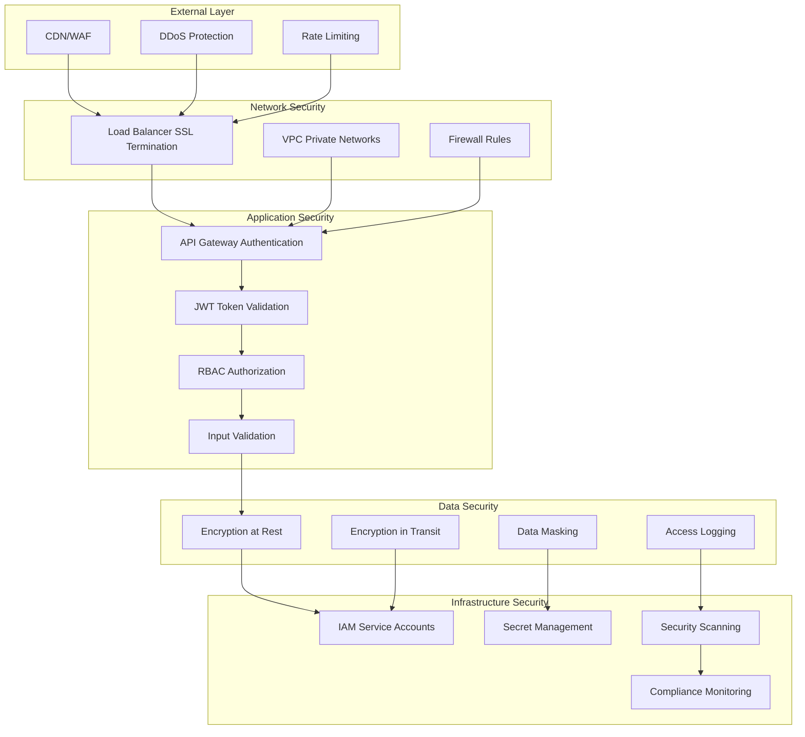
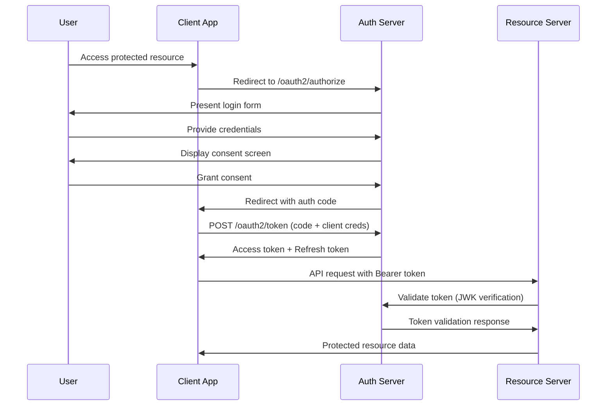

# Security and Authentication Architecture - Social Media Sentiment Analysis Platform

## Overview

This document defines the comprehensive security and authentication architecture for the social media sentiment analysis platform, implementing OAuth 2.0 with JWT Bearer tokens, role-based access control (RBAC), and defense-in-depth security principles to protect sensitive social media data and ensure compliance with privacy regulations.

## Security Architecture Overview

### 1. Security Layers



### 2. Zero Trust Security Model

**Core Principles**:
- Never trust, always verify
- Least privilege access
- Assume breach mentality
- Continuous verification
- Defense in depth

## Authentication Architecture

### 1. OAuth 2.0 Implementation

#### Authorization Server Configuration
```yaml
oauth2:
  authorization_server:
    issuer: "https://auth.sentiment-platform.com"
    authorization_endpoint: "/oauth2/authorize"
    token_endpoint: "/oauth2/token"
    jwks_uri: "/oauth2/jwks"
    userinfo_endpoint: "/oauth2/userinfo"
    revocation_endpoint: "/oauth2/revoke"
    
  supported_flows:
    - "authorization_code"
    - "client_credentials"
    - "refresh_token"
    
  supported_scopes:
    - "sentiment:read"
    - "sentiment:write"
    - "trends:read"
    - "analytics:read"
    - "admin:manage"
    
  token_settings:
    access_token_ttl: "1h"
    refresh_token_ttl: "30d"
    id_token_ttl: "1h"
    authorization_code_ttl: "10m"
```

#### OAuth 2.0 Authorization Code Flow


### 2. JWT Token Structure and Validation

#### JWT Access Token Claims
```json
{
  "iss": "https://auth.sentiment-platform.com",
  "sub": "user-uuid-123",
  "aud": "api.sentiment-platform.com",
  "exp": 1694739600,
  "iat": 1694736000,
  "nbf": 1694736000,
  "jti": "token-uuid-456",
  "scope": "sentiment:read sentiment:write trends:read",
  "user": {
    "id": "user-uuid-123",
    "email": "analyst@company.com",
    "role": "analyst",
    "organization": "company-uuid-789",
    "permissions": [
      "sentiment.analyze",
      "sentiment.batch_process",
      "trends.view_realtime",
      "analytics.view_dashboard"
    ]
  },
  "client": {
    "id": "client-uuid-abc",
    "name": "Sentiment Analysis Dashboard",
    "type": "web_application"
  },
  "amr": ["pwd", "mfa"],
  "acr": "2"
}
```

#### JWT Validation Middleware
```csharp
public class JwtValidationMiddleware
{
    private readonly RequestDelegate _next;
    private readonly JwtSecurityTokenHandler _tokenHandler;
    private readonly TokenValidationParameters _validationParameters;
    private readonly ILogger<JwtValidationMiddleware> _logger;

    public JwtValidationMiddleware(
        RequestDelegate next,
        IConfiguration configuration,
        ILogger<JwtValidationMiddleware> logger)
    {
        _next = next;
        _tokenHandler = new JwtSecurityTokenHandler();
        _logger = logger;

        _validationParameters = new TokenValidationParameters
        {
            ValidateIssuer = true,
            ValidIssuer = configuration["JWT:Issuer"],
            ValidateAudience = true,
            ValidAudience = configuration["JWT:Audience"],
            ValidateLifetime = true,
            ValidateIssuerSigningKey = true,
            IssuerSigningKeyResolver = (token, jwtToken, kid, parameters) =>
            {
                return GetSigningKeysFromJwks(kid);
            },
            ClockSkew = TimeSpan.FromMinutes(5)
        };
    }

    public async Task InvokeAsync(HttpContext context)
    {
        var token = ExtractTokenFromHeader(context.Request);
        
        if (string.IsNullOrEmpty(token))
        {
            context.Response.StatusCode = 401;
            await context.Response.WriteAsync("Missing or invalid authorization header");
            return;
        }

        try
        {
            var principal = _tokenHandler.ValidateToken(token, _validationParameters, out var validatedToken);
            
            // Add additional custom validations
            if (!await ValidateCustomClaims(principal))
            {
                context.Response.StatusCode = 403;
                await context.Response.WriteAsync("Token validation failed");
                return;
            }

            // Set user context
            context.User = principal;
            
            // Log successful authentication
            _logger.LogInformation("User {UserId} authenticated successfully", 
                principal.FindFirst("sub")?.Value);

            await _next(context);
        }
        catch (SecurityTokenException ex)
        {
            _logger.LogWarning(ex, "Token validation failed");
            context.Response.StatusCode = 401;
            await context.Response.WriteAsync("Invalid token");
        }
    }

    private async Task<bool> ValidateCustomClaims(ClaimsPrincipal principal)
    {
        // Validate organization membership
        var organizationId = principal.FindFirst("user.organization")?.Value;
        if (string.IsNullOrEmpty(organizationId))
        {
            return false;
        }

        // Validate user is still active
        var userId = principal.FindFirst("sub")?.Value;
        var user = await _userService.GetUserAsync(userId);
        
        return user?.IsActive == true && user.OrganizationId == organizationId;
    }

    private List<SecurityKey> GetSigningKeysFromJwks(string keyId)
    {
        // Implement JWKS endpoint caching and key retrieval
        var jwks = _jwksCache.GetOrFetch("jwks", async () =>
        {
            using var httpClient = new HttpClient();
            var response = await httpClient.GetStringAsync($"{_validationParameters.ValidIssuer}/.well-known/jwks.json");
            return JsonWebKeySet.Create(response);
        });

        return jwks.Keys.Where(k => k.KeyId == keyId).ToList();
    }
}
```

## Authorization Architecture

### 1. Role-Based Access Control (RBAC)

#### Role Hierarchy
```yaml
roles:
  system_admin:
    description: "Full system administration access"
    permissions: ["*"]
    inherits_from: []
    
  organization_admin:
    description: "Organization-level administration"
    permissions:
      - "users.manage"
      - "analytics.full_access"
      - "sentiment.full_access"
      - "trends.full_access"
      - "reports.generate"
    inherits_from: ["analyst"]
    
  analyst:
    description: "Data analysis and insights"
    permissions:
      - "sentiment.analyze"
      - "sentiment.batch_process"
      - "trends.view_realtime"
      - "trends.view_historical"
      - "analytics.view_dashboard"
      - "reports.view"
    inherits_from: ["viewer"]
    
  viewer:
    description: "Read-only access to data"
    permissions:
      - "sentiment.view_results"
      - "trends.view_basic"
      - "analytics.view_basic"
    inherits_from: []
    
  api_client:
    description: "Programmatic API access"
    permissions:
      - "sentiment.analyze"
      - "sentiment.batch_process"
      - "trends.view_realtime"
    inherits_from: []
```

#### Permission-Based Authorization
```csharp
public class PermissionAuthorizationHandler : AuthorizationHandler<PermissionRequirement>
{
    private readonly IUserPermissionService _permissionService;
    private readonly ILogger<PermissionAuthorizationHandler> _logger;

    protected override async Task HandleRequirementAsync(
        AuthorizationHandlerContext context,
        PermissionRequirement requirement)
    {
        var userId = context.User.FindFirst(ClaimTypes.NameIdentifier)?.Value;
        
        if (string.IsNullOrEmpty(userId))
        {
            context.Fail();
            return;
        }

        var userPermissions = await _permissionService.GetUserPermissionsAsync(userId);
        
        if (userPermissions.Contains(requirement.Permission) || 
            userPermissions.Contains("*"))
        {
            context.Succeed(requirement);
            _logger.LogDebug("Permission {Permission} granted to user {UserId}", 
                requirement.Permission, userId);
        }
        else
        {
            _logger.LogWarning("Permission {Permission} denied for user {UserId}", 
                requirement.Permission, userId);
            context.Fail();
        }
    }
}

// Usage in controllers
[Authorize(Policy = "RequireAnalystPermission")]
[HttpPost("analyze")]
public async Task<IActionResult> AnalyzeSentiment([FromBody] AnalyzeSentimentRequest request)
{
    // Implementation
}

// Policy configuration
services.AddAuthorization(options =>
{
    options.AddPolicy("RequireAnalystPermission", policy =>
        policy.Requirements.Add(new PermissionRequirement("sentiment.analyze")));
});
```

### 2. Resource-Level Authorization

#### Data Isolation by Organization
```csharp
public class OrganizationScopedDbContext : DbContext
{
    private readonly ICurrentUserService _currentUserService;

    protected override void OnModelCreating(ModelBuilder modelBuilder)
    {
        // Apply global query filters for organization isolation
        modelBuilder.Entity<SocialMediaPost>()
            .HasQueryFilter(p => p.OrganizationId == _currentUserService.OrganizationId);
            
        modelBuilder.Entity<SentimentAnalysis>()
            .HasQueryFilter(s => s.Post.OrganizationId == _currentUserService.OrganizationId);
            
        modelBuilder.Entity<TrendAnalysis>()
            .HasQueryFilter(t => t.OrganizationId == _currentUserService.OrganizationId);
    }
}

// Attribute-based authorization for API endpoints
[AttributeBasedAuthorization("sentiment", "read", "organization")]
[HttpGet("{id}")]
public async Task<IActionResult> GetSentimentAnalysis(Guid id)
{
    var analysis = await _context.SentimentAnalyses
        .FirstOrDefaultAsync(s => s.Id == id);
    
    if (analysis == null)
    {
        return NotFound();
    }
    
    return Ok(analysis);
}
```

## API Security Implementation

### 1. API Key Authentication for Service-to-Service

#### API Key Management
```csharp
public class ApiKeyAuthenticationHandler : AuthenticationHandler<ApiKeyAuthenticationOptions>
{
    private readonly IApiKeyService _apiKeyService;

    protected override async Task<AuthenticateResult> HandleAuthenticateAsync()
    {
        if (!Request.Headers.TryGetValue("X-API-Key", out var apiKeyHeaderValues))
        {
            return AuthenticateResult.NoResult();
        }

        var providedApiKey = apiKeyHeaderValues.FirstOrDefault();
        if (string.IsNullOrWhiteSpace(providedApiKey))
        {
            return AuthenticateResult.NoResult();
        }

        var apiKey = await _apiKeyService.ValidateApiKeyAsync(providedApiKey);
        if (apiKey == null || !apiKey.IsActive)
        {
            return AuthenticateResult.Fail("Invalid or inactive API key");
        }

        // Check rate limits
        var rateLimitResult = await _rateLimitService.CheckRateLimitAsync(
            apiKey.Id, apiKey.RateLimitPerHour);
            
        if (!rateLimitResult.IsAllowed)
        {
            return AuthenticateResult.Fail("API key rate limit exceeded");
        }

        var claims = new[]
        {
            new Claim(ClaimTypes.NameIdentifier, apiKey.Id.ToString()),
            new Claim(ClaimTypes.Name, apiKey.Name),
            new Claim("client_type", "api_key"),
            new Claim("organization", apiKey.OrganizationId.ToString()),
            new Claim("rate_limit", apiKey.RateLimitPerHour.ToString())
        };

        var identity = new ClaimsIdentity(claims, Scheme.Name);
        var principal = new ClaimsPrincipal(identity);
        var ticket = new AuthenticationTicket(principal, Scheme.Name);

        return AuthenticateResult.Success(ticket);
    }
}
```

### 2. Input Validation and Sanitization

#### Request Validation Middleware
```csharp
public class RequestValidationMiddleware
{
    private readonly RequestDelegate _next;
    private readonly IValidator<object> _validator;
    private readonly ILogger<RequestValidationMiddleware> _logger;

    public async Task InvokeAsync(HttpContext context)
    {
        // Validate content length
        if (context.Request.ContentLength > 10_000_000) // 10MB limit
        {
            context.Response.StatusCode = 413;
            await context.Response.WriteAsync("Request entity too large");
            return;
        }

        // Validate content type for POST/PUT requests
        if (context.Request.Method.In("POST", "PUT", "PATCH"))
        {
            var contentType = context.Request.ContentType;
            if (!IsAllowedContentType(contentType))
            {
                context.Response.StatusCode = 415;
                await context.Response.WriteAsync("Unsupported media type");
                return;
            }
        }

        // SQL injection prevention for query parameters
        foreach (var param in context.Request.Query)
        {
            if (ContainsSqlInjectionPatterns(param.Value))
            {
                _logger.LogWarning("Potential SQL injection attempt detected: {Query}", param.Value);
                context.Response.StatusCode = 400;
                await context.Response.WriteAsync("Invalid query parameters");
                return;
            }
        }

        await _next(context);
    }

    private bool ContainsSqlInjectionPatterns(string input)
    {
        var patterns = new[]
        {
            @"(\b(ALTER|CREATE|DELETE|DROP|EXEC(UTE){0,1}|INSERT( +INTO){0,1}|MERGE|SELECT|UPDATE|UNION( +ALL){0,1})\b)",
            @"(;|\s)(DROP|DELETE|UPDATE|INSERT|CREATE|ALTER)\s",
            @"(\bOR\b.*=.*\bOR\b|\bAND\b.*=.*\bAND\b)",
            @"(--|/\*|\*/|@@|@)",
            @"(\bCONCAT\b|\bSUBSTRING\b|\bCHAR\b|\bCAST\b)"
        };

        return patterns.Any(pattern => 
            Regex.IsMatch(input, pattern, RegexOptions.IgnoreCase));
    }
}
```

### 3. Rate Limiting Implementation

#### Distributed Rate Limiting with Redis
```csharp
public class RedisRateLimitService : IRateLimitService
{
    private readonly IDatabase _database;
    private readonly ILogger<RedisRateLimitService> _logger;

    public async Task<RateLimitResult> CheckRateLimitAsync(
        string clientId, 
        int limitPerWindow, 
        TimeSpan window)
    {
        var key = $"rate_limit:{clientId}:{window.TotalSeconds}";
        var currentTime = DateTimeOffset.UtcNow.ToUnixTimeSeconds();
        var windowStart = currentTime - (long)window.TotalSeconds;

        var pipeline = _database.CreateBatch();
        
        // Remove expired entries
        var removeExpiredTask = pipeline.SortedSetRemoveRangeByScoreAsync(
            key, 0, windowStart);
        
        // Count current requests in window
        var countTask = pipeline.SortedSetLengthAsync(key);
        
        // Add current request
        var addCurrentTask = pipeline.SortedSetAddAsync(key, currentTime, currentTime);
        
        // Set expiration
        var expireTask = pipeline.KeyExpireAsync(key, window.Add(TimeSpan.FromMinutes(1)));
        
        pipeline.Execute();
        
        await Task.WhenAll(removeExpiredTask, countTask, addCurrentTask, expireTask);
        
        var currentCount = await countTask;
        var isAllowed = currentCount <= limitPerWindow;
        
        if (!isAllowed)
        {
            _logger.LogWarning("Rate limit exceeded for client {ClientId}: {CurrentCount}/{Limit}", 
                clientId, currentCount, limitPerWindow);
        }

        return new RateLimitResult
        {
            IsAllowed = isAllowed,
            CurrentCount = (int)currentCount,
            Limit = limitPerWindow,
            ResetTime = DateTimeOffset.FromUnixTimeSeconds(currentTime + (long)window.TotalSeconds)
        };
    }
}

// Rate limiting attribute
public class RateLimitAttribute : ActionFilterAttribute
{
    private readonly int _limitPerHour;
    
    public RateLimitAttribute(int limitPerHour = 1000)
    {
        _limitPerHour = limitPerHour;
    }

    public override async Task OnActionExecutionAsync(
        ActionExecutingContext context, 
        ActionExecutionDelegate next)
    {
        var rateLimitService = context.HttpContext.RequestServices
            .GetRequiredService<IRateLimitService>();
            
        var clientId = GetClientIdentifier(context.HttpContext);
        var result = await rateLimitService.CheckRateLimitAsync(
            clientId, _limitPerHour, TimeSpan.FromHours(1));

        if (!result.IsAllowed)
        {
            context.Result = new StatusCodeResult(429); // Too Many Requests
            context.HttpContext.Response.Headers.Add("X-RateLimit-Limit", _limitPerHour.ToString());
            context.HttpContext.Response.Headers.Add("X-RateLimit-Remaining", "0");
            context.HttpContext.Response.Headers.Add("X-RateLimit-Reset", result.ResetTime.ToUnixTimeSeconds().ToString());
            return;
        }

        context.HttpContext.Response.Headers.Add("X-RateLimit-Limit", _limitPerHour.ToString());
        context.HttpContext.Response.Headers.Add("X-RateLimit-Remaining", 
            Math.Max(0, _limitPerHour - result.CurrentCount).ToString());

        await next();
    }
}
```

## Data Security and Privacy

### 1. Encryption at Rest and in Transit

#### Database Encryption Configuration
```yaml
database_encryption:
  cloud_sql:
    encryption_at_rest: true
    customer_managed_key: "projects/PROJECT_ID/locations/LOCATION/keyRings/RING_NAME/cryptoKeys/KEY_NAME"
    
  backup_encryption:
    enabled: true
    key_rotation_period: "90d"
    
  connection_encryption:
    ssl_mode: "require"
    ssl_cert_verification: true
```

#### Application-Level Encryption
```csharp
public class DataEncryptionService : IDataEncryptionService
{
    private readonly string _encryptionKey;
    private readonly ILogger<DataEncryptionService> _logger;

    public string EncryptSensitiveData(string plaintext)
    {
        if (string.IsNullOrEmpty(plaintext))
            return plaintext;

        using var aes = Aes.Create();
        aes.Key = Convert.FromBase64String(_encryptionKey);
        aes.GenerateIV();

        using var encryptor = aes.CreateEncryptor();
        using var msEncrypt = new MemoryStream();
        using var csEncrypt = new CryptoStream(msEncrypt, encryptor, CryptoStreamMode.Write);
        using var swEncrypt = new StreamWriter(csEncrypt);

        swEncrypt.Write(plaintext);
        
        var encrypted = Convert.ToBase64String(aes.IV.Concat(msEncrypt.ToArray()).ToArray());
        
        _logger.LogDebug("Data encrypted successfully");
        return encrypted;
    }

    public string DecryptSensitiveData(string ciphertext)
    {
        if (string.IsNullOrEmpty(ciphertext))
            return ciphertext;

        var fullCipher = Convert.FromBase64String(ciphertext);
        var iv = fullCipher.Take(16).ToArray();
        var cipher = fullCipher.Skip(16).ToArray();

        using var aes = Aes.Create();
        aes.Key = Convert.FromBase64String(_encryptionKey);
        aes.IV = iv;

        using var decryptor = aes.CreateDecryptor();
        using var msDecrypt = new MemoryStream(cipher);
        using var csDecrypt = new CryptoStream(msDecrypt, decryptor, CryptoStreamMode.Read);
        using var srDecrypt = new StreamReader(csDecrypt);

        return srDecrypt.ReadToEnd();
    }
}

// Entity Framework value converter for automatic encryption
public class EncryptedStringConverter : ValueConverter<string, string>
{
    public EncryptedStringConverter(IDataEncryptionService encryptionService) 
        : base(
            v => encryptionService.EncryptSensitiveData(v),
            v => encryptionService.DecryptSensitiveData(v))
    {
    }
}
```

### 2. Data Masking and Anonymization

#### Personal Data Protection
```csharp
public class PersonalDataProtectionService : IPersonalDataProtectionService
{
    public string MaskEmail(string email)
    {
        if (string.IsNullOrEmpty(email) || !email.Contains("@"))
            return email;

        var parts = email.Split('@');
        var localPart = parts[0];
        var domain = parts[1];

        if (localPart.Length <= 2)
            return $"**@{domain}";

        var maskedLocal = localPart[0] + new string('*', localPart.Length - 2) + localPart[^1];
        return $"{maskedLocal}@{domain}";
    }

    public string AnonymizeUserId(string userId)
    {
        using var sha256 = SHA256.Create();
        var hashedBytes = sha256.ComputeHash(Encoding.UTF8.GetBytes(userId + _salt));
        return Convert.ToBase64String(hashedBytes)[0..8]; // First 8 characters
    }

    public SocialMediaPost SanitizeForPublicApi(SocialMediaPost post)
    {
        return new SocialMediaPost
        {
            Id = post.Id,
            Content = post.Content, // Content can be public
            Platform = post.Platform,
            UserId = AnonymizeUserId(post.UserId), // Anonymize user ID
            UserName = "***", // Hide username
            Timestamp = post.Timestamp,
            // Exclude other sensitive fields
        };
    }
}
```

## Security Monitoring and Incident Response

### 1. Security Event Logging

#### Audit Trail Implementation
```csharp
public class SecurityAuditMiddleware
{
    private readonly RequestDelegate _next;
    private readonly ISecurityAuditService _auditService;

    public async Task InvokeAsync(HttpContext context)
    {
        var stopwatch = Stopwatch.StartNew();
        var requestBody = await ReadRequestBodyAsync(context.Request);

        try
        {
            await _next(context);
        }
        finally
        {
            stopwatch.Stop();
            
            var auditEvent = new SecurityAuditEvent
            {
                UserId = context.User.FindFirst(ClaimTypes.NameIdentifier)?.Value,
                Action = $"{context.Request.Method} {context.Request.Path}",
                IpAddress = context.Connection.RemoteIpAddress?.ToString(),
                UserAgent = context.Request.Headers["User-Agent"].ToString(),
                StatusCode = context.Response.StatusCode,
                Duration = stopwatch.Elapsed,
                RequestSize = requestBody?.Length ?? 0,
                Timestamp = DateTime.UtcNow,
                Success = context.Response.StatusCode < 400
            };

            await _auditService.LogSecurityEventAsync(auditEvent);
        }
    }
}
```

### 2. Threat Detection

#### Anomaly Detection Service
```csharp
public class ThreatDetectionService : IThreatDetectionService
{
    public async Task<ThreatAssessment> AssessRequestAsync(HttpContext context)
    {
        var assessment = new ThreatAssessment();
        
        // Check for suspicious patterns
        await CheckForBruteForceAttack(context, assessment);
        await CheckForAnomalousUserAgent(context, assessment);
        await CheckForSuspiciousGeography(context, assessment);
        await CheckForDataExfiltrationPatterns(context, assessment);

        if (assessment.ThreatLevel >= ThreatLevel.High)
        {
            await _alertService.SendSecurityAlertAsync(assessment);
        }

        return assessment;
    }

    private async Task CheckForBruteForceAttack(HttpContext context, ThreatAssessment assessment)
    {
        var clientId = GetClientIdentifier(context);
        var failedAttempts = await _cache.GetStringAsync($"failed_auth:{clientId}");
        
        if (int.TryParse(failedAttempts, out var attempts) && attempts > 10)
        {
            assessment.AddThreat(ThreatType.BruteForce, 
                $"Multiple failed authentication attempts: {attempts}");
        }
    }

    private async Task CheckForSuspiciousGeography(HttpContext context, ThreatAssessment assessment)
    {
        var ipAddress = context.Connection.RemoteIpAddress?.ToString();
        var geoInfo = await _geoService.GetLocationAsync(ipAddress);
        var userId = context.User.FindFirst(ClaimTypes.NameIdentifier)?.Value;
        
        if (!string.IsNullOrEmpty(userId))
        {
            var userProfile = await _userService.GetUserLocationProfileAsync(userId);
            
            if (IsGeographicallyAnomalous(geoInfo, userProfile))
            {
                assessment.AddThreat(ThreatType.GeographicalAnomaly,
                    $"Login from unusual location: {geoInfo.Country}, {geoInfo.City}");
            }
        }
    }
}
```

## Compliance and Privacy

### 1. GDPR Compliance Implementation

#### Data Subject Rights
```csharp
public class GdprComplianceService : IGdprComplianceService
{
    public async Task<PersonalDataExport> ExportPersonalDataAsync(string userId)
    {
        var export = new PersonalDataExport
        {
            UserId = userId,
            ExportDate = DateTime.UtcNow,
            Data = new Dictionary<string, object>()
        };

        // Export user profile data
        var user = await _userRepository.GetByIdAsync(userId);
        export.Data["Profile"] = new
        {
            user.Email,
            user.FirstName,
            user.LastName,
            user.CreatedAt
        };

        // Export user's sentiment analysis requests
        var sentimentRequests = await _sentimentRepository
            .GetByUserIdAsync(userId);
        export.Data["SentimentAnalyses"] = sentimentRequests.Select(s => new
        {
            s.Id,
            s.CreatedAt,
            s.Content, // If the user posted it
            s.Results
        });

        return export;
    }

    public async Task<bool> DeletePersonalDataAsync(string userId)
    {
        using var transaction = await _context.Database.BeginTransactionAsync();
        
        try
        {
            // Anonymize user posts instead of deleting (for analytics integrity)
            var posts = await _context.SocialMediaPosts
                .Where(p => p.UserId == userId)
                .ToListAsync();
                
            foreach (var post in posts)
            {
                post.UserId = "anonymized";
                post.UserName = "***";
            }

            // Delete user account
            var user = await _context.Users.FindAsync(userId);
            if (user != null)
            {
                _context.Users.Remove(user);
            }

            await _context.SaveChangesAsync();
            await transaction.CommitAsync();
            
            // Log GDPR deletion event
            await _auditService.LogGdprEventAsync(new GdprEvent
            {
                UserId = userId,
                Action = "DataDeletion",
                Timestamp = DateTime.UtcNow
            });

            return true;
        }
        catch (Exception ex)
        {
            await transaction.RollbackAsync();
            _logger.LogError(ex, "Failed to delete personal data for user {UserId}", userId);
            return false;
        }
    }
}
```

### 2. Data Retention Policies

#### Automated Data Cleanup
```csharp
public class DataRetentionService : IDataRetentionService
{
    public async Task ExecuteRetentionPoliciesAsync()
    {
        var policies = await _policyRepository.GetActiveRetentionPoliciesAsync();
        
        foreach (var policy in policies)
        {
            switch (policy.DataType